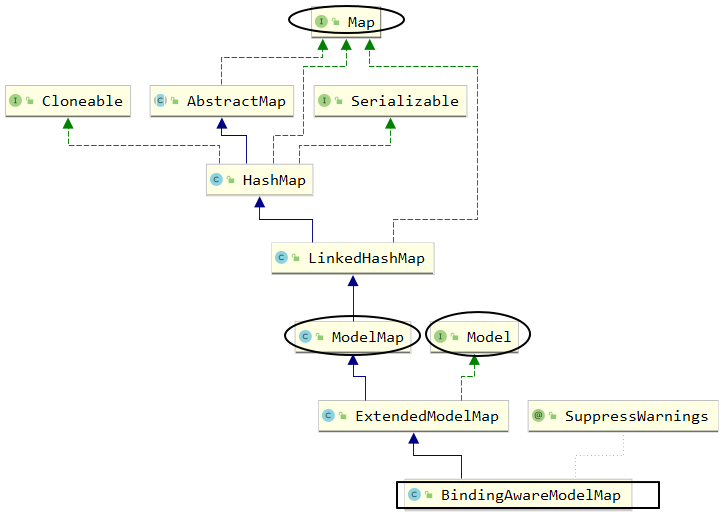

[TOC]

# 第二节 属性域

## 1、在整个应用中属性域的重要作用

[参考资料]([verse03 (gitee.io)](http://heavy_code_industry.gitee.io/code_heavy_industry/pro001-javaweb/lecture/bookstore05/verse03.html))


## 2、请求域操作方式

### ①使用 Model 类型的形参

```java
@RequestMapping("/attr/request/model")
public String testAttrRequestModel(
    
        // 在形参位置声明Model类型变量，用于存储模型数据
        Model model) {
    
    // 我们将数据存入模型，SpringMVC 会帮我们把模型数据存入请求域
    // 存入请求域这个动作也被称为暴露到请求域
    model.addAttribute("requestScopeMessageModel","i am very happy[model]");
    
    return "target";
}
```


### ②使用 ModelMap 类型的形参

```java
@RequestMapping("/attr/request/model/map")
public String testAttrRequestModelMap(
    
        // 在形参位置声明ModelMap类型变量，用于存储模型数据
        ModelMap modelMap) {
    
    // 我们将数据存入模型，SpringMVC 会帮我们把模型数据存入请求域
    // 存入请求域这个动作也被称为暴露到请求域
    modelMap.addAttribute("requestScopeMessageModelMap","i am very happy[model map]");
    
    return "target";
}
```


### ③使用 Map 类型的形参

```java
@RequestMapping("/attr/request/map")
public String testAttrRequestMap(
    
        // 在形参位置声明Map类型变量，用于存储模型数据
        Map<String, Object> map) {
    
    // 我们将数据存入模型，SpringMVC 会帮我们把模型数据存入请求域
    // 存入请求域这个动作也被称为暴露到请求域
    map.put("requestScopeMessageMap", "i am very happy[map]");
    
    return "target";
}
```


### ④使用原生 request 对象

```java
@RequestMapping("/attr/request/original")
public String testAttrOriginalRequest(
    
        // 拿到原生对象，就可以调用原生方法执行各种操作
        HttpServletRequest request) {
    
    request.setAttribute("requestScopeMessageOriginal", "i am very happy[original]");
    
    return "target";
}
```


### ⑤使用 ModelAndView 对象

```java
@RequestMapping("/attr/request/mav")
public ModelAndView testAttrByModelAndView() {
    
    // 1.创建ModelAndView对象
    ModelAndView modelAndView = new ModelAndView();
    
    // 2.存入模型数据
    modelAndView.addObject("requestScopeMessageMAV", "i am very happy[mav]");
    
    // 3.设置视图名称
    modelAndView.setViewName("target");
    
    return modelAndView;
}
```


## 3、模型的本质

### ①BindingAwareModelMap

SpringMVC 传入的 Model、ModelMap、Map类型的参数其实本质上都是 BindingAwareModelMap 类型的。


### ②它们之间的关系




## 4、框架底层将模型存入请求域

### ①最终找到的源码位置

所在类：org.thymeleaf.context.WebEngineContext

所在方法：setVariable()


### ②过程中值得关注的点


## 5、会话域

使用会话域最简单直接的办法就是使用原生的 HttpSession 对象

```java
@RequestMapping("/attr/session")
public String attrSession(
        // 使用会话域最简单直接的办法就是使用原生的 HttpSession 对象
        HttpSession session) {
    
    session.setAttribute("sessionScopeMessage", "i am haha ...");
    
    return "target";
}
```


## 6、应用域

应用域同样是使用原生对象来操作：

```java
@Autowired
private ServletContext servletContext;

@RequestMapping("/attr/application")
public String attrApplication() {
    
    servletContext.setAttribute("appScopeMsg", "i am hungry...");
    
    return "target";
}
```


[上一节](verse01.html) [回目录](index.html) [下一节](verse03.html)