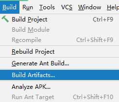

[TOC]

# 第三节 静态资源访问

## 1、静态资源的概念

资源本身已经是可以直接拿到浏览器上使用的程度了，不需要在服务器端做任何运算、处理。典型的静态资源包括：

- 纯HTML文件
- 图片
- CSS文件
- JavaScript文件
- ……


## 2、SpringMVC 环境下静态资源问题

### ①情况一：斜杠情况

#### [1]情景描述

DispatcherServlet 的 url-pattern 标签配置的是“/”。意味着整个 Web 应用范围内所有请求都由 SpringMVC 来处理。


#### [2]情景重现

在 Web 应用中加入图片资源：


部署目录下不会自动加入，需要我们手动重新构建才行：


重新构建应用参考下面的操作步骤：




#### [3]访问静态资源


#### [4]分析原因

- DispatcherServlet 的 url-pattern 配置的是“/”
- url-pattern 配置“/”表示整个 Web 应用范围内所有请求都由 SpringMVC 来处理
- 对 SpringMVC 来说，必须有对应的 @RequestMapping 才能找到处理请求的方法
- 现在 images/mi.jpg 请求没有对应的 @RequestMapping 所以返回 404


#### [5]解决办法

- 在 SpringMVC 配置文件中增加配置：

```xml
<!-- 加入这个配置，SpringMVC 就会在遇到没有 @RequestMapping 的请求时放它过去 -->
<!-- 所谓放它过去就是让这个请求去找它原本要访问的资源 -->
<mvc:default-servlet-handler/>
```

- 再次测试访问图片：


- 新的问题：其他原本正常的请求访问不了了
- 进一步解决问题：再增加一个配置

```xml
<!-- 开启 SpringMVC 的注解驱动功能。这个配置也被称为 SpringMVC 的标配。 -->
<!-- 标配：因为 SpringMVC 环境下非常多的功能都要求必须打开注解驱动才能正常工作。 -->
<mvc:annotation-driven/>
```


#### [6]default-servlet-handler底层[了解]

所在类：org.springframework.web.servlet.resource.DefaultServletHttpRequestHandler

关键方法：handleRequest()方法

大体机制：SpringMVC 首先查找是否存在和当前请求对应的 @RequestMapping；如果没有，则调用handleRequest()方法转发到目标资源。

```java
@Override
public void handleRequest(HttpServletRequest request, HttpServletResponse response)
			throws ServletException, IOException {
	
	Assert.state(this.servletContext != null, "No ServletContext set");
	RequestDispatcher rd = this.servletContext.getNamedDispatcher(this.defaultServletName);
	if (rd == null) {
		throw new IllegalStateException("A RequestDispatcher could not be located for the default servlet '" +
		this.defaultServletName + "'");
	}
    
    // 这里执行请求转发操作
	rd.forward(request, response);
}
```


### ②情况二：扩展名情况

#### [1]修改 url-pattern

```xml
<servlet>
    <servlet-name>DispatcherServlet</servlet-name>
    <servlet-class>org.springframework.web.servlet.DispatcherServlet</servlet-class>
    <init-param>
        <param-name>contextConfigLocation</param-name>
        <param-value>classpath:spring-mvc.xml</param-value>
    </init-param>
    <load-on-startup>1</load-on-startup>
</servlet>
<servlet-mapping>
    <servlet-name>DispatcherServlet</servlet-name>
    <!--<url-pattern>/</url-pattern>-->
    
    <!-- 以扩展名方式匹配 SpringMVC 要处理的请求 -->
    <!-- 此时要求请求扩展名必须是 html，SpringMVC 才会处理这个请求 -->
    <url-pattern>*.html</url-pattern>
</servlet-mapping>
```


#### [2]效果

- 图片直接就可以访问了。因为请求扩展名不是 html，不会受到 SpringMVC 影响。
- 其他请求：做下面两个操作才可以正常访问
  - 需要在超链接地址后面附加 html 扩展名
  - 在 @RequestMapping 注解指定的 URL 地址中也附加 html 扩展名


[上一节](verse02.html) [回目录](index.html) [下一节](verse04.html)