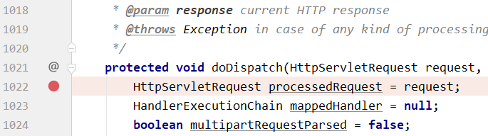

[TOC]

# 第四节 mvc:view-controller

## 1、需求情景

在一个 handler 方法中，仅仅只是完成 @RequestMapping 映射，将请求转发到目标视图，除此之外没有任何其他代码。此时可以使用 SpringMVC 配置文件中的配置代替这样的 handler 方法。


## 2、具体操作

### ①配置

在 SpringMVC 配置文件中使用 mvc:view-controller 配置：

```xml
<mvc:view-controller path="/index.html" view-name="portal"/>
```


同时，handler 类中就可以去掉被代替的方法。


### ②新的问题

加入 mvc:view-controller 配置后，其他正常 @RequestMapping 将失效。此时还是需要加入 mvc:annotation-driven 来解决。


## 3、三个配置影响访问效果探索[了解]

### ①相关组件：HandlerMapping

见名知意，HandlerMapping 封装的数据包含了请求地址和 handler 方法之间的映射关系。所以请求访问是否能生效关键要看 HandlerMapping 在 IOC 容器中加载的情况。为了看到这一点，我们可以在 DispatcherServlet 中找到 doDispatch() 方法设置断点。之所以选择这个方法，是因为每一个由 SpringMVC 处理的请求都会经过这里，便于操作。




### ②分三种情况查看

#### [1]三个标签都没有配置


我们看到 SpringMVC 加载了三个 HandlerMapping：

> org.springframework.web.servlet.handler.<span style="color:blue;font-weight:bold;">BeanNameUrlHandlerMapping</span>
>
> org.springframework.web.servlet.mvc.method.annotation.<span style="color:blue;font-weight:bold;">RequestMappingHandlerMapping</span>
>
> org.springframework.web.servlet.function.support.<span style="color:blue;font-weight:bold;">RouterFunctionMapping</span>

其中 RequestMappingHandlerMapping 封装了 @RequestMapping 相关请求，有它在 @RequestMapping 相关请求就能访问到。


这里顺带一提，在较低版本的 SpringMVC 此处要加载的是：

> org.springframework.web.servlet.handler.BeanNameUrlHandlerMapping
> org.springframework.web.servlet.mvc.annotation.DefaultAnnotationHandlerMapping

其中 DefaultAnnotationHandlerMapping 封装了 @RequestMapping 相关请求，有它在 @RequestMapping 相关请求就能访问到。


#### [2]增加一个标签

配置了 mvc:view-controller 或 mvc:default-servlet-handler 之后。


我们看到 SpringMVC 加载了两个 HandlerMapping：

> org.springframework.web.servlet.handler.<span style="color:blue;font-weight:bold;">SimpleUrlHandlerMapping</span>
>
> org.springframework.web.servlet.handler.<span style="color:blue;font-weight:bold;">BeanNameUrlHandlerMapping</span>


较低版本的 SpringMVC 在这里的情况一样。


#### [3]全部配置三个标签

配置全部 mvc:view-controller、mvc:default-servlet-handler、mvc:annotation-driven 三个标签。


我们看到 SpringMVC 加载了略有不同的三个 HandlerMapping：

> org.springframework.web.servlet.mvc.method.annotation.<span style="color:blue;font-weight:bold;">RequestMappingHandlerMapping</span>
>
> org.springframework.web.servlet.handler.<span style="color:blue;font-weight:bold;">SimpleUrlHandlerMapping</span>
>
> org.springframework.web.servlet.handler.<span style="color:blue;font-weight:bold;">BeanNameUrlHandlerMapping</span>


较低版本的 SpringMVC 在这里的情况还是一样。


### ③结论

在配置不同的情况下，SpringMVC 底层加载的组件不同，特定功能需要特定组件的支持。当特定功能所需组件没有加入到 IOC 容器中的时候，对应的功能就无法使用了。

还有一点是：<span style="color:blue;font-weight:bold;">mvc:annotation-driven</span> 是 SpringMVC <span style="color:blue;font-weight:bold;">标配</span>，必加。


[上一节](verse03.html) [回目录](index.html) [下一节](verse05.html)