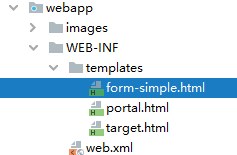

[TOC]

# 第五节 表单标签

主要的目的是在页面上实现表单回显。最典型的情况是在修改数据时，把之前旧的数据重新显示出来供用户参考。


## 1、回显简单标签

一个标签回显一个值的情况。


### ①创建用于测试的实体类

```java
public class Tiger {

    private Integer tigerId;
    private String tigerName;
    private Double tigerSalary;
    ……
```


### ②创建 handler 方法

```java
@RequestMapping("/form/redisplay/simple")
public String simpleTagRedisplay(Model model) {
    
    // 1.准备好用来回显表单的实体类对象
    // 在实际功能中，这里的对象应该是从数据库查询得到
    Tiger tiger = new Tiger();
    tiger.setTigerId(5);
    tiger.setTigerName("tomCat");
    tiger.setTigerSalary(666.66);
        
    // 2.将实体类数据存入模型
    model.addAttribute("tiger", tiger);
    
    return "form-simple";
}
```


### ③页面表单回显



```html
<h3>回显Tiger数据</h3>
    
<form th:action="@{/save/tiger}" method="post">
    
    <!-- th:value 和 th:field 属性都可以 -->
    老虎的id：<input type="text" name="tigerId" th:value="${tiger.tigerId}" /><br/>
    老虎的名字：<input type="text" name="tigerName" th:field="${tiger.tigerName}" /><br/>
    老虎的工资：<input type="text" name="tigerSalary" th:field="${tiger.tigerSalary}" /><br/>
    
    <button type="submit">保证</button>
</form>
```


## 2、回显带选择功能的标签

### ①总体思路

- 显示标签本身，需要用到一个集合对象来存储标签本身所需要的数据
- 对标签执行回显操作，需要用到另外的一个实体类


### ②创建实体类

#### [1]用来显示标签的实体类

```java
public class Season {
    
    // 提交给服务器的值
    private String submitValue;
    
    // 给用户看的值
    private String showForUserValue;
    ……
```


#### [2]用来回显数据的实体类

```java
public class Paige {
    
    private Integer paigeId;
    private String paigeName;
    private Season season;
    ……
```


### ③handler 方法

```java
@RequestMapping("/form/redisplay/choose")
public String chooseTagRedisplay(Model model) {
    
    // 1.准备用来显示标签的数据
    List<Season> seasonList = new ArrayList<>();
    seasonList.add(new Season("spring", "春天"));
    seasonList.add(new Season("summer", "夏天"));
    seasonList.add(new Season("autumn", "秋天"));
    seasonList.add(new Season("winter", "冬天"));
    
    model.addAttribute("seasonList", seasonList);
    
    // 2.准备用来回显表单的实体类数据
    Paige paige = new Paige();
    paige.setPaigeId(6);
    paige.setPaigeName("pig");
    paige.setSeason(new Season("summer", "夏天"));
    
    model.addAttribute("paige", paige);
    
    return "form-choose";
}
```


### ③页面表单回显

#### [1]单选按钮

```html
<!-- th:each属性：指定用来生成这一组标签的集合数据 -->
<!-- th:value属性：获取数据用来设置HTML标签的value属性，成为将来提交给服务器的值 -->
<!-- th:text属性：获取数据用来设置HTML标签旁边给用户看的名字 -->
<!-- th:checked属性：判断是否回显（把适合的标签设置为默认被选中） -->
<input type="radio" name="season.submitValue"
        th:each="season : ${seasonList}"
        th:value="${season.submitValue}"
        th:text="${season.showForUserValue}"
        th:checked="${season.submitValue == paige.season.submitValue}"
/>
```


#### [2]下拉列表

```html
<select name="season.submitValue">
    <option th:each="season : ${seasonList}"
            th:value="${season.submitValue}"
            th:text="${season.showForUserValue}"
            th:selected="${season.submitValue == paige.season.submitValue}"/>
</select>
```


#### [3]多选框

- 另外封装一个实体类

```html
public class John {
    
    private List<Season> seasonList;
    
    public List<Season> getSeasonList() {
        return seasonList;
    }
    
    public void setSeasonList(List<Season> seasonList) {
        this.seasonList = seasonList;
    }
}
```

- handler方法

```java
@RequestMapping("/form/redisplay/choose/multi")
public String chooseMulti(Model model) {
    
    // 1.准备用来显示标签的数据
    List<Season> seasonList = new ArrayList<>();
    seasonList.add(new Season("spring", "春天"));
    seasonList.add(new Season("summer", "夏天"));
    seasonList.add(new Season("autumn", "秋天"));
    seasonList.add(new Season("winter", "冬天"));
    
    model.addAttribute("seasonList", seasonList);
    
    // 2.准备用来回显表单的实体类数据
    John john = new John();
    List<Season> seasonListForRedisplay = new ArrayList<>();
    seasonListForRedisplay.add(new Season("summer", "夏天"));
    seasonListForRedisplay.add(new Season("winter", "冬天"));
    
    model.addAttribute("seasonListForRedisplay", seasonListForRedisplay);
    
    return "form-multi";
}
```

- 页面标签

```html
<!--
    seasonListForRedisplay.contains(season)
    用包含回显数据的集合调用contains()方法判断是否应该被选中；
    传入contains()方法的是生成具体每一个标签时遍历得到的对象
 -->
<input type="checkbox" name="xxx"
       th:each="season : ${seasonList}"
       th:value="${season.submitValue}"
       th:text="${season.showForUserValue}"
       th:checked="${seasonListForRedisplay.contains(season)}"
/>
```

注意：此时需要判断一个对象是否在集合中，那就需要重写equals()和hashCode()方法。


[上一节](verse04.html) [回目录](index.html) [下一节](verse06.html)