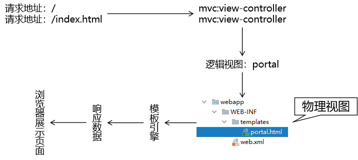

[TOC]

# 具体功能一：显示首页

## 1、流程图




## 2、具体实现

### ①配置 view-controller

```xml
    <!-- 使用 mvc:view-controller 功能就不必编写 handler 方法，直接跳转 -->
    <mvc:view-controller path="/" view-name="portal"/>
    <mvc:view-controller path="/index.html" view-name="portal"/>
```


### ②页面


```html
<!DOCTYPE html>
<html lang="en" xmlns:th="http://www.thymeleaf.org">
<head>
    <meta charset="UTF-8">
    <title>Title</title>
</head>
<body style="text-align: center">
    
    <a th:href="@{/show/list}">显示电影列表</a>
    
</body>
</html>
```


[回目录](../verse06.html) [下一个功能](feature02.html)