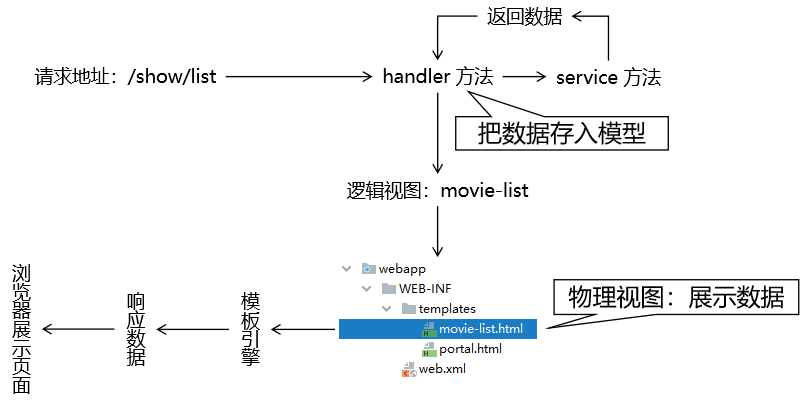
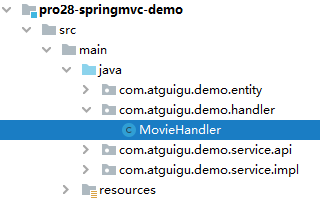

[TOC]

# 具体功能二：显示全部数据

## 1、流程图




## 2、handler 方法



```java
@Controller
public class MovieHandler {
    
    @Autowired
    private MovieService movieService;
    
    @RequestMapping("/show/list")
    public String showList(Model model) {
            
        // 1.调用 Service 方法查询数据
        List<Movie> movieList = movieService.getAll();
            
        // 2.将数据存入模型
        model.addAttribute("movieList", movieList);
    
        // 3.返回逻辑视图名称
        return "movie-list";
    }
        
}
```


## 3、页面

### ①样式部分

```html
<style type="text/css">
    table {
        border-collapse: collapse;
        margin: 0px auto 0px auto;
    }
    table th,td {
        border: 1px solid black;
        text-align: center;
    }
</style>
```


### ②数据展示

```html
<table>
    <tr>
        <th>电影ID</th>
        <th>电影名称</th>
        <th>电影票价格</th>
        <th>删除</th>
        <th>更新</th>
    </tr>
    <tbody th:if="${#lists.isEmpty(movieList)}">
        <tr>
            <td colspan="5">抱歉！没有查询到数据！</td>
        </tr>
    </tbody>
    <tbody th:if="${not #lists.isEmpty(movieList)}">
        <tr th:each="movie : ${movieList}">
            <td th:text="${movie.movieId}">这里显示电影ID</td>
            <td th:text="${movie.movieName}">这里显示电影名称</td>
            <td th:text="${movie.moviePrice}">这里显示电影价格</td>
            <td>删除</td>
            <td>更新</td>
        </tr>
        <tr>
            <td colspan="5">添加</td>
        </tr>
    </tbody>
</table>
```


[上一个功能](feature01.html) [回目录](../verse06.html) [下一个功能](feature03.html)