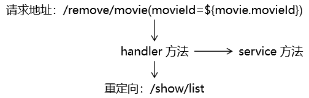

[TOC]

# 具体功能三：删除

## 1、流程图




## 2、超链接

```html
<a th:href="@{/remove/movie(movieId=${movie.movieId})}">删除</a>
```


## 3、handler 方法

```java
@RequestMapping("/remove/movie")
public String removeMovie(
        // 获取请求参数，从形参这里传进来
        @RequestParam("movieId") String movieId,
    
        Model model
) {
    
    // 1.根据 movieId 执行删除
    movieService.removeMovieById(movieId);
    
    // 方案一：直接使用列表页面的逻辑视图名称
    // 结果：无法显示数据
    // 原因：没有将列表数据存入模型，所以页面上无法从请求域获取数据来展示
    // return "movie-list";
    
    // 方案二：我们自己查数据，存入模型，然后返回列表页面的逻辑视图
    // 结果：能够显示数据
    // 建议：不要使用。因为代码重复了。
    // List<Movie> movieList = movieService.getAll();
    // model.addAttribute("movieList", movieList);
    // return "movie-list";
    
    // 方案三：调用那个返回列表页面的方法
    // 结果：能够显示数据
    // 建议：不要使用。破坏了程序的结构，同时浏览器地址栏显示的还是删除操作的地址，刷新浏览器会重复执行删除操作。
    // return showList(model);
    
    // 方案四：转发到显示列表页面功能的地址
    // 结果：能够显示数据
    // 建议：不要使用。浏览器地址栏显示的还是删除操作的地址，刷新浏览器会重复执行删除操作。
    // return "forward:/show/list";
    
    // 方案五：重定向到显示列表页面功能的地址
    // 结果：能够显示数据
    // 建议：建议使用。
    return "redirect:/show/list";
}
```


[上一个功能](feature02.html) [回目录](../verse06.html) [下一个功能](feature04.html)