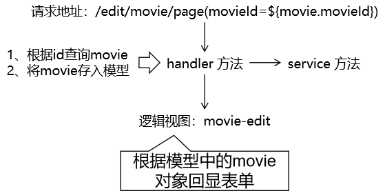

[TOC]

# 具体功能六：更新的表单

## 1、流程图




## 2、超链接

```html
<a th:href="@{/edit/movie/page(movieId=${movie.movieId})}">更新</a>
```


## 3、handler 方法

```java
@RequestMapping("/edit/movie/page")
public String editMoviePage(
    
        // 获取请求参数
        @RequestParam("movieId") String movieId,
        
        Model model
) {
    
    // 1.根据id查询movie对象
    Movie movie = movieService.getMovieById(movieId);
        
    // 2.将movie对象存入模型
    model.addAttribute("movie", movie);
    
    // 3.返回逻辑视图
    return "movie-edit";
}
```


## 4、准备表单页面并回显

```html
<form th:action="@{/update/movie}" method="post">
    
    <input type="hidden" name="movieId" th:value="${movie.movieId}" />
    
    电影名称：<input type="text" name="movieName" th:value="${movie.movieName}" /><br/>
    电影票价格：<input type="text" name="moviePrice" th:value="${movie.moviePrice}" /><br/>
    
    <button type="submit">更新</button>
    
</form>
```


[上一个功能](feature05.html) [回目录](../verse06.html) [下一个功能](feature07.html)