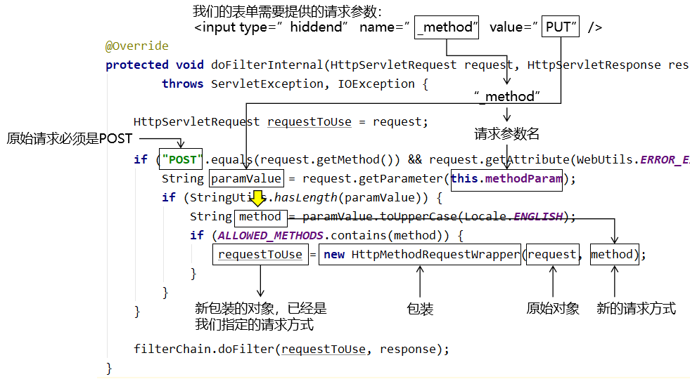
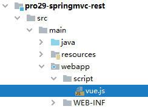

[TOC]

# 第二节 四种请求方式映射

## 1、HiddenHttpMethodFilter 与装饰模式

### ①简介

在 HTML 中，GET 和 POST 请求可以天然实现，但是 DELETE 和 PUT 请求无法直接做到。SpringMVC 提供了 <span style="color:blue;font-weight:bold;">HiddenHttpMethodFilter</span> 帮助我们<span style="color:blue;font-weight:bold;">将 POST 请求转换为 DELETE 或 PUT 请求</span>。


### ②HiddenHttpMethodFilter 源码要点

#### [1]默认请求参数名常量

```java
public static final String DEFAULT_METHOD_PARAM = "_method";
```

在 HiddenHttpMethodFilter 中，声明了一个常量：DEFAULT_METHOD_PARAM，常量值是"_method"。


#### [2]和常量配套的成员变量

```java
private String methodParam = DEFAULT_METHOD_PARAM;
```

之所以会提供这个成员变量和配套的 setXxx() 方法，是允许我们在配置 Filter 时，通过初始化参数来修改这个变量。如果不修改，默认就是前面常量定义的值。


#### [3]以常量值为名称获取请求参数




### ③原始请求对象的包装

#### [1]困难

- 包装对象必须和原始对象是同一个类型
- 保证同一个类型不能通过子类继承父类实现
  - 子类对象：希望改变行为、属性的对象
  - 父类对象：随着 Servlet 容器的不同，各个容器对 HttpServletRequest 接口给出的实现不同。如果继承了 A 容器给出的实现类，那么将来就不能再迁移到 B 容器。
- 只能让包装对象和被包装对象实现相同接口
  - 虽然使用动态代理技术大致上应该能实现，但是一旦应用代理就必须为被包装的对象的每一个方法都进行代理，操作过于繁琐。
- 如果我们自己创建一个类实现 HttpServletRequest 接口
  - 困难1：我们其实并不知道具体该怎么做
  - 困难2：抽象方法实在太多


#### [2] HttpServletRequestWrapper 类

HttpServletRequestWrapper 类能够非常好的帮助我们对原始 request 对象进行包装。它为什么能帮我们解决上面的困难呢？

- HttpServletRequestWrapper  类替我们实现了HttpServletRequest 接口
- 为了让包装得到的新对象在任何 Servlet 容器平台上都能够正常工作，HttpServletRequestWrapper  类此处的设计非常巧妙：它借助原始的 request 对象本身来实现所有的具体功能
- 在我们想通过包装的方式来修改原始对象的行为或属性时，只需要在 HttpServletRequestWrapper  类的子类中重写对应的方法即可


#### [3]HttpMethodRequestWrapper 类

HttpMethodRequestWrapper 类就是 HiddenHttpMethodFilter 的一个内部类，在 HttpMethodRequestWrapper 类中有如下行为实现了对原始对象的包装：

- 继承了官方包装类：HttpServletRequestWrapper
- 在构造器中将原始 request 对象传给了父类构造器
- 将我们指定的新请求方式传给了成员变量
- 重写了父类（官方包装类）的 getMethod() 方法
- 外界想知道新包装对象的请求方式时，会来调用被重写的 getMethod() 方法，从而得到我们指定的请求方式

```java
/**
 * Simple {@link HttpServletRequest} wrapper that returns the supplied method for
 * {@link HttpServletRequest#getMethod()}.
 */
private static class HttpMethodRequestWrapper extends HttpServletRequestWrapper {
	
	private final String method;
	
	public HttpMethodRequestWrapper(HttpServletRequest request, String method) {
        // 在构造器中将原始 request 对象传给了父类构造器
		super(request);
        
        // 将我们指定的新请求方式传给了成员变量
		this.method = method;
	}
	
	@Override
	public String getMethod() {
		return this.method;
	}
}
```


### ④装饰者模式

装饰者模式也是二十三种设计模式之一，属于结构型模式，主要特点就是借助原始对象实现和原始对象一样的接口，同时通过重写父类方法修改被包装对象的行为。


## 2、PUT 请求

以下操作需要在已有的 SpringMVC 环境基础上执行：

### ①web.xml

```xml
<filter>
    <filter-name>hiddenHttpMethodFilter</filter-name>
    <filter-class>org.springframework.web.filter.HiddenHttpMethodFilter</filter-class>
</filter>
<filter-mapping>
    <filter-name>hiddenHttpMethodFilter</filter-name>
    <url-pattern>/*</url-pattern>
</filter-mapping>
```


### ②表单

- 要点1：原请求方式必须是 post
- 要点2：新的请求方式名称通过请求参数发送
- 要点3：请求参数名称必须是_method
- 要点4：请求参数的值就是要改成的请求方式

```html
<!-- 原请求方式必须是 post -->
<form th:action="@{/emp}" method="post">
    <!-- 通过表单隐藏域携带一个请求参数 -->
    <!-- 请求参数名：_method -->
    <!-- 请求参数值：put -->
    <input type="hidden" name="_method" value="put" />

    <button type="submit">更新</button>
</form>
```


### ③handler 方法

```java
// 映射请求地址：URL + 请求方式
@RequestMapping(value = "/emp", method = RequestMethod.PUT)
public String updateEmp() {
    
    logger.debug("现在执行的是 updateEmp() 方法");
    
    return "target";
}
```


### ④请求方式 Filter 对字符集 Filter 的影响

#### [1]结论

当 web.xml 中两个 Filter 并存，<span style="color:blue;font-weight:bold;">一定要让 CharacterEncodingFilter 先执行</span>。


#### [2]原因

- 在 CharacterEncodingFilter 中通过 request.setCharacterEncoding(encoding) 方法设置字符集的
- request.setCharacterEncoding(encoding) 方法要求前面不能有任何获取请求参数的操作
- 而 HiddenHttpMethodFilter 恰恰有一个获取请求方式的操作：

```java
String paramValue = request.getParameter(this.methodParam);
```


## 3、DELETE 请求

前面为了转换 PUT 请求所配置的环境仍然要继续使用。


### ①设定场景

通常删除超链接会出现在列表页面：

```html
<h3>将XXX请求转换为DELETE请求</h3>
<table id="dataTable">
    <tr>
        <th>姓名</th>
        <th>年龄</th>
        <th>删除</th>
    </tr>
    <tr>
        <td>张三</td>
        <td>40</td>
        <td>
            <a th:href="@{/emp}" @click="doConvert">删除</a>
        </td>
    </tr>
    <tr>
        <td>李四</td>
        <td>30</td>
        <td>
            <a th:href="@{/emp}" @click="doConvert">删除</a>
        </td>
    </tr>
</table>
```


### ②创建负责转换的表单

```html
<!-- 创建一个通用表单，在删除超链接的单击响应函数中通过这个表单把GET请求转换为POST，进而再转DELETE -->
<form method="post" id="convertForm">
    <input type="hidden" name="_method" value="delete" />
</form>
```


### ③给删除超链接绑定单击响应函数

#### [1]引入Vue



```html
<script type="text/javascript" th:src="@{/script/vue.js}"></script>
```


#### [2]绑定单击响应函数

```javascript
new Vue({
    "el":"#dataTable",
    "methods":{
        "doConvert":function (event) {

            // 1.先根据id获取到表单的元素对象
            var formEle = document.getElementById("convertForm");

            // 2.将表单的action属性设置为当前超链接的href属性
            // ①之所以要这样赋值就是为了将来提交表单的时候访问的还是原超链接要访问的地址
            // ②event对象：当前事件对象
            // ③event.target对象：发生事件的元素对象，现在是我们点击的超链接
            // ④event.target.href属性：超链接的href属性值
            // ⑤formEle.action属性：表单的action属性的值
            formEle.action = event.target.href;

            // 3.提交表单
            formEle.submit();

            // 阻止超链接的默认行为（跳转页面）
            event.preventDefault();
        }
    }
});
```


### ④handler 方法

```java
@RequestMapping(value = "/emp", method = RequestMethod.DELETE)
public String removeEmp() {
    
    logger.debug("现在执行的是 removeEmp() 方法");
    
    return "target";
}
```


[上一节](verse01.html) [回目录](index.html) [下一节](verse03.html)