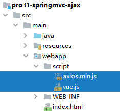
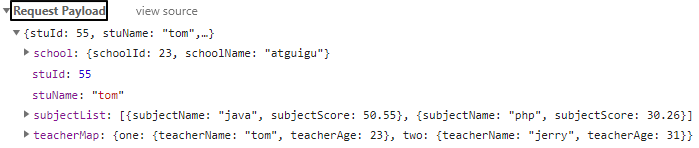

[TOC]

# 第一节 Ajax

## 1、实验一

请求：发送普通请求参数

handler 方法：使用 @RequestParam 注解接收请求参数

响应：服务器端返回普通文本


### ①引入 JavaScript 库




```html
<script type="text/javascript" src="script/vue.js"></script>
<script type="text/javascript" src="script/axios.min.js"></script>
```


### ②前端代码

```javascript
new Vue({
    "el":"#btnSpan",
    "methods":{
        "experimentOne":function () {
 
            // 请求：发送普通请求参数
            // 响应：普通文本
            axios({
                "method":"post",
                "url":"ajax/experiment/one",
                "params":{
                    "userName":"tom",
                    "password":"123456"
                }
            }).then(function (response) {
 
                // response接收服务器端返回的响应数据
                console.log(response);
            }).catch(function (response) {
                console.log(response);
            });
 
        }
    }
});
```


### ③后端代码

```java
// 使用@ResponseBody注解告诉 SpringMVC：请你拿当前方法的返回值作为响应体，不要再找视图了
// 方法返回值类型有两种情况：
// 情况一：简单类型。SpringMVC 会直接作为响应体数据。
// 情况二：复杂类型。SpringMVC 会把它转换为 JSON 然后再作为响应体。此时需要 Jackson 的支持。
@ResponseBody
@RequestMapping("/ajax/experiment/one")
public String experimentOne(
 
        // Ajax请求发过来的请求参数，对服务器端来说没有区别，还是像以前一样正常接收
        @RequestParam("userName") String userName,
        @RequestParam("password") String password
) {
 
    logger.debug("userName = " + userName);
    logger.debug("password = " + password);
 
    // 服务器端给Ajax程序的响应数据通过handler方法的返回值提供
    return "message from handler as response[来自服务器的问候]";
}
```


## 2、实验二

请求：让整个请求体就是一个 JSON 数据

handler 方法：使用 @RequestBody 标记的实体类接收请求体数据

响应：返回普通文本


### ①前端代码

```javascript
"experimentTwo":function () {
 
    axios({
        "method":"post",
        "url":"ajax/experiment/two",
 
        // data属性中指定一个 JSON 数据作为请求体
        "data":{
            "stuId": 55,
            "stuName": "tom",
            "subjectList": [
                {
                    "subjectName": "java",
                    "subjectScore": 50.55
                },
                {
                    "subjectName": "php",
                    "subjectScore": 30.26
                }
            ],
            "teacherMap": {
                "one": {
                    "teacherName":"tom",
                    "teacherAge":23
                },
                "two": {
                    "teacherName":"jerry",
                    "teacherAge":31
                },
            },
            "school": {
                "schoolId": 23,
                "schoolName": "atguigu"
            }
        }
    }).then(function (response) {
        console.log(response);
    }).catch(function (error) {
        console.log(error);
    });
 
}
```


### ②后端代码

#### [1]导入依赖

```xml
<!-- https://mvnrepository.com/artifact/com.fasterxml.jackson.core/jackson-databind -->
<dependency>
    <groupId>com.fasterxml.jackson.core</groupId>
    <artifactId>jackson-databind</artifactId>
    <version>2.12.1</version>
</dependency>
```


如果忘记导入这个依赖，会看到下面的错误页面：


关于 SpringMVC 和 Jackson jar包之间的关系，需要注意：当 SpringMVC 需要解析 JSON 数据时就需要使用 Jackson 的支持。但是 SpringMVC 的 jar 包并没有依赖 Jackson，所以需要我们自己导入。

我们自己导入时需要注意：SpringMVC 和 Jackson 配合使用有版本的要求。二者中任何一个版本太高或太低都不行。

SpringMVC 解析 JSON 数据包括两个方向：

- 从 JSON 字符串到 Java 实体类。
- 从 Java 实体类到 JSON 字符串。


另外，如果导入了 Jackson 依赖，但是没有开启 mvc:annotation-driven 功能，那么仍然会返回上面的错误页面。


也就是说，我们可以这么总结 SpringMVC 想要解析 JSON 数据需要两方面支持：

- mvc:annotation-driven
- 引入 Jackson 依赖


还有一点，如果运行环境是 Tomcat7，那么在 Web 应用启动时会抛出下面异常：

> org.apache.tomcat.util.bcel.classfile.ClassFormatException: Invalid byte tag in constant pool: 19

解决办法是使用 Tomcat8 或更高版本。


#### [2]handler 方法

```java
@ResponseBody
@RequestMapping("/ajax/experiment/two")
public String experimentTwo(

        // 使用 @RequestBody 注解将请求体 JSON 数据解析出来，注入到对应的实体类中
        @RequestBody Student student
        ) {
    
    logger.debug(student.toString());
    
    return "message from handler as response[来自服务器的问候]";
}
```


#### [3]@RequestBody注解

适用 @RequestBody 注解的场景：请求体整个是一个 JSON 数据



Request Payload 翻译成中文大致可以说：请求负载。


## 3、实验三

请求：发送普通的请求参数，请求参数整体正好对应实体类

handler 方法：使用普通实体类接收请求参数

响应：返回普通文本数据


### ①前端代码

```javascript
"experimentThree":function () {
 
    axios({
        "method":"post",
        "url":"ajax/experimentThree",
 
        // 普通的请求参数正好对应服务器端的一个实体类
        "params":{
            "soldierId":"666",
            "soldierName":"tigerMan"
        }
    }).then(function (response) {
        console.log(response);
    }).catch(function (error) {
        console.log(error);
    });
 
}
```


### ②后端代码

```java
@ResponseBody
@RequestMapping("/ajax/experimentThree")
public String experimentThree(
 
        // 请求参数名正好对这个实体类的属性名，可以通过 setXxx() 方法直接注入
        Soldier soldier) {
 
    logger.debug(soldier.toString());
 
    return "message from handler as response[来自服务器的问候]";
}
```


### ③常见错误

如果前端程序使用 axios 的 params 属性发送请求参数，那么请求参数会附着在 URL 地址后面，此时当前请求没有请求体。同时服务器端 handler 方法使用了 @RequestBody 注解，会在日志中看到下面异常信息：

> HttpMessageNotReadableException: Required request body is missing:

意思是需要请求体，但是没有找到。


## 4、实验四

请求：不需要发送任何数据

handler 方法：返回实体类

响应：服务器端返回由实体类生成的 JSON 数据


### ①前端代码

```javascript
"experimentFour":function () {
 
    axios({
        "method":"post",
        "url":"ajax/experimentFour"
    }).then(function (response) {
        console.log(response);
 
        // 服务器返回的响应体数据被封装到了 data 属性中
        console.log(response.data);
        console.log("response.data.soldierId = " + response.data.soldierId);
        console.log("response.data.soldierName = " + response.data.soldierName);
    }).catch(function (error) {
        console.log(error);
    });
 
}
```


### ②后端代码

```java
// 使用 @ResponseBody 注解标记的方法返回实体类数据时，
// SpringMVC 需要借助 Jackson 来将实体类转换为 JSON 数据
@ResponseBody
@RequestMapping("/ajax/experimentFour")
public Soldier experimentFour() {
 
    return new Soldier(333, "catMan");
}
```


浏览器控制台打印效果如下：


### ③常见错误

#### [1]415 错误


出现上面的错误页面，表示 SpringMVC 为了将 实体类对象转换为 JSON 数据，需要转换器。但是现在找不到转换器。它想要成功完成转换需要两方面支持：

- mvc:annotation-driven
- 引入 Jackson 依赖


#### [2]406 错误


问题出现的原因：

- 请求地址扩展名：html
- 服务器端打算返回的数据格式：JSON

上面二者不一致。SpringMVC 要坚守一个商人的良心，不能干『挂羊头，卖狗肉』的事儿。解决办法有三种思路：

- 第一种方法：不使用请求扩展名
- 第二种方法：使用和实际返回的数据格式一致的扩展名

```xml
    <servlet-mapping>
        <servlet-name>dispatcherServlet</servlet-name>
        <url-pattern>*.html</url-pattern>
        <url-pattern>*.json</url-pattern>
    </servlet-mapping>
```

- 第三种方法：使用一个 HTTP 协议中没有被定义的扩展名，例如：*.atguigu


## 5、@RestController

### ①提取@ResponseBody

如果类中每个方法上都标记了 @ResponseBody 注解，那么这些注解就可以提取到类上。


### ②合并

类上的 @ResponseBody 注解可以和 @Controller 注解合并为 @RestController 注解。所以使用了 @RestController 注解就相当于给类中的每个方法都加了 @ResponseBody 注解。


### ③@RestController源码

```java
@Target(ElementType.TYPE)
@Retention(RetentionPolicy.RUNTIME)
@Documented
@Controller
@ResponseBody
public @interface RestController {
 
	/**
	 * The value may indicate a suggestion for a logical component name,
	 * to be turned into a Spring bean in case of an autodetected component.
	 * @return the suggested component name, if any (or empty String otherwise)
	 * @since 4.0.1
	 */
	@AliasFor(annotation = Controller.class)
	String value() default "";
 
}
```


## 6、SpringMVC 4 版本响应体字符集设置

```java
// 当返回响应体数据包含乱码时，在@RequestMapping注解中设置
// produces属性给响应体设置内容类型
@ResponseBody
@RequestMapping(value = "/ajax/get/message", produces = "text/html;charset=UTF-8")
public String getMessage() {
    return "message from server:你好";
}
 
// 如果返回 JSON 数据时遇到乱码问题，那么内容类型应设置为：application/json;charset=UTF-8
// 这里需要注意：JSON 属于 application 这个大类，不属于 text
@ResponseBody
@RequestMapping(value = "/ajax/get/entity", produces = "application/json;charset=UTF-8")
public Emp getEntity() {
 
    Emp emp = new Emp();
 
    emp.setEmpName("舔狗");
 
    return emp;
}
```


[回目录](index.html) [下一节](verse02.html)