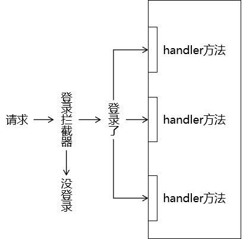

[TOC]

# 第二节 拦截器

## 1、概念

### ①拦截器和过滤器解决类似的问题

#### [1]生活中坐地铁的场景

为了提高乘车效率，在乘客进入站台前统一检票：


#### [2]程序中

在程序中，使用拦截器在请求到达具体 handler 方法前，统一执行检测。




### ②拦截器 VS 过滤器

#### [1]相似点

三要素相同

- 拦截：必须先把请求拦住，才能执行后续操作
- 过滤：拦截器或过滤器存在的意义就是对请求进行统一处理
- 放行：对请求执行了必要操作后，放请求过去，让它访问原本想要访问的资源


#### [2]不同点

- 工作平台不同
  - 过滤器工作在 Servlet 容器中
  - 拦截器工作在 SpringMVC 的基础上
- 拦截的范围
  - 过滤器：能够拦截到的最大范围是整个 Web 应用
  - 拦截器：能够拦截到的最大范围是整个 SpringMVC 负责的请求
- IOC 容器支持
  - 过滤器：想得到 IOC 容器需要调用专门的工具方法，是间接的
  - 拦截器：它自己就在 IOC 容器中，所以可以直接从 IOC 容器中装配组件，也就是可以直接得到 IOC 容器的支持


#### [3]选择

功能需要如果用 SpringMVC 的拦截器能够实现，就不使用过滤器。


## 2、使用

### ①创建拦截器类

#### [1]实现接口

```java
public class Process01Interceptor implements HandlerInterceptor {
 
    Logger logger = LoggerFactory.getLogger(this.getClass());
 
    // 在处理请求的目标 handler 方法前执行
    @Override
    public boolean preHandle(HttpServletRequest request, HttpServletResponse response, Object handler) throws Exception {
        
        logger.debug("Process01Interceptor preHandle方法");
         
        // 返回true：放行
        // 返回false：不放行
        return true;
    }
 
    // 在目标 handler 方法之后，渲染视图之前
    @Override
    public void postHandle(HttpServletRequest request, HttpServletResponse response, Object handler, ModelAndView modelAndView) throws Exception {
 
        logger.debug("Process01Interceptor postHandle方法");
        
    }
 
    // 渲染视图之后执行
    @Override
    public void afterCompletion(HttpServletRequest request, HttpServletResponse response, Object handler, Exception ex) throws Exception {
        
        logger.debug("Process01Interceptor afterCompletion方法");
        
    }
}
```


<span style="color:blue;font-weight:bold;">单个拦截器执行顺序</span>：

- preHandle() 方法
- 目标 handler 方法
- postHandle() 方法
- 渲染视图
- afterCompletion() 方法


#### [2]继承类

在较低版本的 SpringMVC 中，实现 HandlerInterceptor 接口需要把所有抽象方法都实现。但是又不是每个方法都需要使用，导致代码比较繁琐。

此时可以通过继承 HandlerInterceptorAdapter 类同样可以创建拦截器类。HandlerInterceptorAdapter 类中已经给 HandlerInterceptor 接口提供了默认实现，我们继承后不需要把每个方法都实现，只需要把有用的方法重写即可。

在 SpringMVC 较高版本（例如：5.3版本以上）中，HandlerInterceptor 接口已经借助 JDK 1.8 新特性让每个抽象方法都给出了默认实现，所以 HandlerInterceptorAdapter 这个类被标记为过时。

```java
@Deprecated
public abstract class HandlerInterceptorAdapter implements AsyncHandlerInterceptor {

}
```


### ②注册拦截器

#### [1]默认拦截全部请求

```xml
<!-- 注册拦截器 -->
<mvc:interceptors>
    
    <!-- 直接通过内部 bean 配置的拦截器默认拦截全部请求（SpringMVC 范围内） -->
    <bean class="com.atguigu.mvc.interceptor.Process01Interceptor"/>
</mvc:interceptors>
```


#### [2]配置拦截路径

##### (1)精确匹配

```xml
<!-- 具体配置拦截器可以指定拦截的请求地址 -->
<mvc:interceptor>
    <!-- 精确匹配 -->
    <mvc:mapping path="/common/request/one"/>
    <bean class="com.atguigu.mvc.interceptor.Process03Interceptor"/>
</mvc:interceptor>
```


##### (2)模糊匹配：匹配单层路径

```xml
<mvc:interceptor>
    <!-- /*匹配路径中的一层 -->
    <mvc:mapping path="/common/request/*"/>
    <bean class="com.atguigu.mvc.interceptor.Process04Interceptor"/>
</mvc:interceptor>
```


##### (3)模糊匹配：匹配多层路径

```xml
<mvc:interceptor>
    <!-- /**匹配路径中的多层 -->
    <mvc:mapping path="/common/request/**"/>
    <bean class="com.atguigu.mvc.interceptor.Process05Interceptor"/>
</mvc:interceptor>
```


#### [3]配置不拦截路径

```xml
        <mvc:interceptor>
            <!-- /**匹配路径中的多层 -->
            <mvc:mapping path="/common/request/**"/>
 
            <!-- 使用 mvc:exclude-mapping 标签配置不拦截的地址 -->
            <mvc:exclude-mapping path="/common/request/two/bbb"/>
 
            <bean class="com.atguigu.mvc.interceptor.Process05Interceptor"/>
        </mvc:interceptor>
```


### ③多个拦截器执行顺序

- preHandle()方法：和配置的顺序一样
- 目标handler方法
- postHandle()方法：和配置的顺序相反
- 渲染视图
- afterCompletion()方法：和配置的顺序相反


## 3、案例

一个网站有 5 个资源，其中两个无须登录即可访问，另外三个需要登录后才能访问。如果不登录就访问那三个资源，会自动跳转到登录页面并给出提示：请登录后再操作。

提示：将数据存入请求域、转发或重定向请求都需要使用原生对象来完成，在拦截器中 SpringMVC 并没有提供 Model、ModelMap 等 API 供我们使用。

访问资源的请求地址可参考：

- 公共资源1：/public/resource/one
- 公共资源2：/public/resouce/two
- 私密资源1：/private/resouce/one
- 私密资源2：/private/resouce/two
- 私密资源3：/private/resouce/three


[上一节](verse01.html) [回目录](index.html) [下一节](verse03.html)