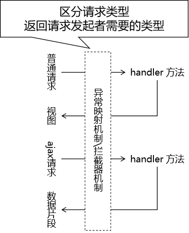

[TOC]

# 第五节 异常映射

## 1、概念

### ①微观

将异常类型和某个具体的视图关联起来，建立映射关系。好处是可以通过 SpringMVC 框架来帮助我们管理异常。

- 声明式管理异常：在配置文件中指定异常类型和视图之间的对应关系。在配置文件或注解类中统一管理。
- 编程式管理异常：需要我们自己手动 try ... catch ... 捕获异常，然后再手动跳转到某个页面。


### ②宏观

一个项目中会包含很多个模块，各个模块需要分工完成。如果张三负责的模块按照 A 方案处理异常，李四负责的模块按照 B 方法处理异常……各个模块处理异常的思路、代码、命名细节都不一样，那么就会让整个项目非常混乱。


## 2、异常映射的好处

- 使用声明式代替编程式来实现异常管理
  - 让异常控制和核心业务解耦，二者各自维护，结构性更好
- 整个项目层面使用同一套规则来管理异常
  - 整个项目代码风格更加统一、简洁
  - 便于团队成员之间的彼此协作


## 3、基于 XML 的异常映射

### ①配置

SpringMVC 会根据异常映射信息，在捕获到指定异常对象后，将异常对象存入请求域，然后转发到和异常类型关联的视图。

```xml
<bean id="exceptionResolver"
      class="org.springframework.web.servlet.handler.SimpleMappingExceptionResolver">
 
    <!-- 配置异常映射关系 -->
    <property name="exceptionMappings">
        <props>
            <!-- key属性：指定异常类型 -->
            <!-- 文本标签体：和异常类型对应的逻辑视图 -->
            <prop key="java.lang.ArithmeticException">error-arith</prop>
        </props>
    </property>
 
    <!-- 使用 exceptionAttribute 属性配置将异常对象存入请求域时使用的属性名 -->
    <!-- 这个属性名默认是exception -->
    <property name="exceptionAttribute" value="atguiguException"/>
</bean>
```


### ②异常范围

如果在配置文件中，发现有多个匹配的异常类型，那么 SpringMVC 会采纳范围上最接近的异常映射关系。

```xml
<prop key="java.lang.ArithmeticException">error-arith</prop>
<prop key="java.lang.RuntimeException">error-runtime</prop>
```


## 4、基于注解的异常映射

### ①创建异常处理器类


### ②异常处理器类加入 IOC 容器

```xml
<context:component-scan base-package="com.atguigu.mvc.handler,com.atguigu.mvc.exception"/>
```


### ③给异常处理器类标记注解

```java
// 异常处理器类需要使用 @ControllerAdvice 注解标记
@ControllerAdvice
public class MyExceptionHandler {
    
}
```


### ④声明处理异常的方法

```java
// @ExceptionHandler注解：标记异常处理方法
// value属性：指定匹配的异常类型
// 异常类型的形参：SpringMVC 捕获到的异常对象
@ExceptionHandler(value = NullPointerException.class)
public String resolveNullPointerException(Exception e, Model model) {
 
    // 我们可以自己手动将异常对象存入模型
    model.addAttribute("atguiguException", e);
 
    // 返回逻辑视图名称
    return "error-nullpointer";
}
```


当同一个异常类型在基于 XML 和注解的配置中都能够找到对应的映射，那么以注解为准。


## 5、区分请求类型

### ①分析

异常处理机制和拦截器机制都面临这样的问题：




### ②判断依据

查看请求消息头中是否包含 Ajax 请求独有的特征：

- Accept 请求消息头：包含 application/json
- X-Requested-With 请求消息头：包含 XMLHttpRequest

两个条件满足一个即可。

```java
/**
 * 判断当前请求是否为Ajax请求
 * @param request 请求对象
 * @return
 * 		true：当前请求是Ajax请求
 * 		false：当前请求不是Ajax请求
 */
public static boolean judgeRequestType(HttpServletRequest request) {
 	
	// 1.获取请求消息头
	String acceptHeader = request.getHeader("Accept");
	String xRequestHeader = request.getHeader("X-Requested-With");
 	
	// 2.判断
	return (acceptHeader != null && acceptHeader.contains("application/json"))
 			
			||
 			
			(xRequestHeader != null && xRequestHeader.equals("XMLHttpRequest"));
}
```


### ③兼容两种请求的处理方法

```java
@ExceptionHandler(value = Exception.class)
public String resolveException(Exception e, HttpServletRequest request, HttpServletResponse response) throws IOException {
 
    // 调用工具方法判断当前请求是否是 Ajax 请求
    boolean judgeResult = MVCUtil.judgeRequestType(request);
 
    if (judgeResult) {
 
        // 对 Ajax 请求返回字符串作为响应体
        String message = e.getMessage();
 
        response.setContentType("text/html;charset=UTF-8");
        response.getWriter().write(message);
 
        // 上面已经使用原生 response 对象返回了响应，这里就不返回视图名称了
        return null;
    }
 
    // 对普通请求返回逻辑视图名称
    return "error-exception";
}
```


[上一节](verse04.html) [回目录](index.html) [下一节](verse06.html)