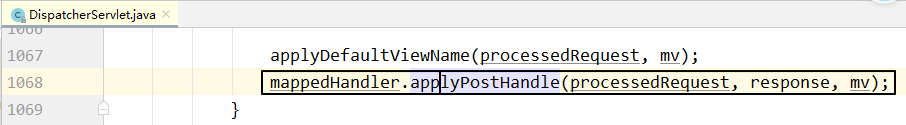
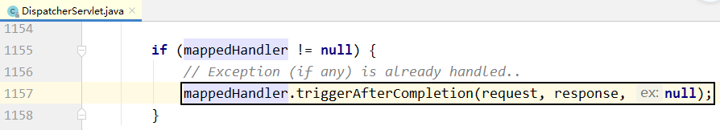

[TOC]

# 第二节 请求处理过程

## 1、总体阶段

### ①流程描述

- 目标 handler 方法执行<span style="color:blue;font-weight:bold;">前</span>
  - 建立调用链，确定整个执行流程
  - 拦截器的 preHandle() 方法
  - 注入请求参数
  - 准备目标 handler 方法所需所有参数
- <span style="color:blue;font-weight:bold;">调用</span>目标 handler 方法
- 目标 handler 方法执行<span style="color:blue;font-weight:bold;">后</span>
  - 拦截器的 postHandle() 方法
  - 渲染视图
  - 拦截器的 afterCompletion() 方法


### ②核心代码

整个请求处理过程都是 doDispatch() 方法在宏观上协调和调度，把握了这个方法就理解了 SpringMVC 总体上是如何处理请求的。

所在类：org.springframework.web.servlet.<span style="color:blue;font-weight:bold;">DispatcherServlet</span>

所在方法：doDispatch()

核心方法中的核心代码：

```java
// Actually invoke the handler.
mv = ha.handle(processedRequest, response, mappedHandler.getHandler());
```


## 2、调用前阶段

### ①建立调用链

#### [1]相关组件

全类名：org.springframework.web.servlet.HandlerExecutionChain


拦截器索引默认是 -1，说明开始的时候，它指向第一个拦截器前面的位置。每执行一个拦截器，就把索引向前移动一个位置。所以这个索引每次都是指向当前拦截器。所以它相当于拦截器的<span style="color:blue;font-weight:bold;">指针</span>。


#### [2]对应操作

所在类：org.springframework.web.servlet.handler.AbstractHandlerMapping


结论：调用链是由拦截器和目标 handler 对象组成的。


### ②调用拦截器 preHandle()

所在类：org.springframework.web.servlet.DispatcherServlet

所在方法：doDispatch()


具体调用细节：正序调用

所在类：org.springframework.web.servlet.HandlerExecutionChain

所在方法：applyPreHandle


从这部分代码我们也能看到，为什么拦截器中的 preHandle() 方法通过返回布尔值能够控制是否放行。

- 每一个拦截器的 preHandle() 方法都返回 true：applyPreHandle() 方法返回 true，被取反就不执行 if 分支，继续执行后续操作，这就是放行。
- 任何一个拦截器的 preHandle() 方法返回 false：applyPreHandle() 方法返回 false，被取反执行 if 分支，return，导致 doDispatch() 方法结束，不执行后续操作，就是不放行。


### ③注入请求参数

#### [1]相关组件

接口：org.springframework.web.servlet.HandlerAdapter

作用：字面含义是适配器的意思，具体功能有三个

- 将请求参数绑定到实体类对象中
- 给目标 handler 方法准备所需的其他参数，例如：
  - Model、ModelMap、Map……
  - 原生 Servlet API：request、response、session……
  - BindingResult
  - @RequestParam 注解标记的零散请求参数
  - @PathVariable 注解标记的路径变量
- 调用目标 handler 方法


#### [2]创建并获取这个组件

所在类：org.springframework.web.servlet.DispatcherServlet

所在方法：doDispatch()


#### [3]具体操作：调用目标 handler 方法

所在类：org.springframework.web.servlet.DispatcherServlet

所在方法：doDispatch()


#### [4]具体操作：注入请求参数


通过反射给对应属性注入请求参数应该是下面的过程：

- 获取请求参数名称
- 将请求参数名称首字母设定为大写
- 在首字母大写后的名称前附加 set，得到目标方法名
- 通过反射调用 setXxx() 方法


### ④准备其他参数

以 Model 为例来进行说明。

#### [1]背景

在 handler 方法中，如果需要 Model、ModelMap、Map 等对象用来存放模型数据，那么直接在 handler 方法中声明这些类型的形参即可。

而不管我们声明 Model、ModelMap、Map 三者中的任何一个，其实实际传入的对象都是 BindingAwareModelMap 类型的。


#### [2]相关组件

组件类：org.springframework.web.method.support.ModelAndViewContainer

相关属性：defaultModel

```java
private final ModelMap defaultModel = new BindingAwareModelMap();
```

从这个属性的声明能够看出：defaultModel 直接就是用 BindingAwareModelMap 对象来初始化的。


#### [3]相关操作

相关接口：org.springframework.web.servlet.HandlerAdapter

所在类：org.springframework.web.servlet.mvc.method.annotation.RequestMappingHandlerAdapter

所在方法：invokeHandlerMethod()

操作1：创建 ModelAndViewContainer 对象


操作2：把 ModelAndViewContainer 对象传给 invokeAndHandle() 方法


## 3、调用后阶段

### ①调用拦截器的 postHandle() 方法

所在类：org.springframework.web.servlet.DispatcherServlet

所在方法：doDispatch()




调用细节：从拦截器集合长度 - 1 开始循环，循环到 0 为止。所以是<span style="color:blue;font-weight:bold;">倒序</span>执行。


### ②渲染视图

#### [1]所有后续操作的入口

所在类：org.springframework.web.servlet.DispatcherServlet

所在方法：doDispatch()


#### [2]后续细节1：处理异常

所在类：org.springframework.web.servlet.DispatcherServlet

所在方法：processDispatchResult()


#### [3]后续细节2：渲染视图

所在类：org.springframework.web.servlet.DispatcherServlet

所在方法：processDispatchResult()


补充细节：模型数据存入请求域的具体位置

所在类：org.thymeleaf.context.WebEngineContext.RequestAttributesVariablesMap

所在方法：setVariable()


### ③调用拦截器的 afterCompletion() 方法

所在类：org.springframework.web.servlet.DispatcherServlet

所在方法：processDispatchResult()




调用细节：从拦截器索引开始循环，直到循环变量 i 被减到 0 为止。这样的效果是前面执行拦截器到哪里，就从哪里倒回去执行；前面没有执行的拦截器，现在也不执行。


## 4、所有断点总结

断点位置基准：SpringMVC 版本采用 5.3.1 且源码已经下载，包含注释。

| 所在类                                                       | 所在方法                   | 断点行数 | 作用                                                    |
| ------------------------------------------------------------ | -------------------------- | -------- | ------------------------------------------------------- |
| DispatcherServlet                                            | doDispatch()               | 1037     | 创建调用链对象                                          |
| DispatcherServlet                                            | doDispatch()               | 1044     | 创建 HandlerAdapter 对象                                |
| DispatcherServlet                                            | doDispatch()               | 1056     | 调用拦截器 preHandle()方法                              |
| DispatcherServlet                                            | doDispatch()               | 1061     | 执行目标 handler 方法                                   |
| DispatcherServlet                                            | doDispatch()               | 1068     | 调用拦截器 postHandle()方法                             |
| DispatcherServlet                                            | doDispatch()               | 1078     | 执行所有后续操作                                        |
| AbstractHandlerMapping                                       | getHandlerExecutionChain() | 592      | 创建调用链对象                                          |
| AbstractHandlerMapping                                       | getHandlerExecutionChain() | 599      | 在调用链中添加拦截器                                    |
| HandlerExecutionChain                                        | applyPreHandle()           | 146      | 调用拦截器 preHandle()方法                              |
| HandlerExecutionChain                                        | applyPostHandle()          | 163      | 调用拦截器 postHandle()方法                             |
| HandlerExecutionChain                                        | triggerAfterCompletion     | 175      | 调用拦截器 afterCompletion()方法                        |
| DataBinder                                                   | doBind()                   | 747      | 执行数据绑定                                            |
| RequestMappingHandlerAdapter                                 | invokeHandlerMethod()      | 868      | 创建 ModelAndViewContainer 对象                         |
| RequestMappingHandlerAdapter                                 | invokeHandlerMethod()      | 893      | 将ModelAndViewContainer 对象传入调用目标 handler 的方法 |
| DispatcherServlet                                            | processDispatchResult()    | 1125     | 处理异常                                                |
| DispatcherServlet                                            | processDispatchResult()    | 1139     | 渲染视图                                                |
| DispatcherServlet                                            | processDispatchResult()    | 1157     | 调用拦截器 afterCompletion()方法                        |
| WebEngineContext的内部类：<br />RequestAttributesVariablesMap | setVariable()              | 783      | 将模型数据存入请求域                                    |


[上一节](verse01.html) [回目录](index.html) [下一节](verse03.html)