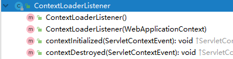
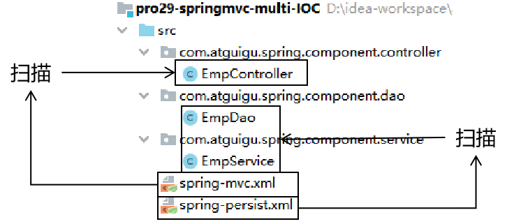

[TOC]

# 第三节 ContextLoaderListener

## 1、提出问题

目前情况：DispatcherServlet 加载 spring-mvc.xml，此时整个 Web 应用中只创建一个 IOC 容器。将来整合Mybatis、配置声明式事务，全部在 spring-mvc.xml 配置文件中配置也是可以的。可是这样会导致配置文件太长，不容易维护。

所以想到把配置文件分开：

- 处理浏览器请求相关：spring-mvc.xml 配置文件
- 声明式事务和整合Mybatis相关：spring-persist.xml 配置文件

配置文件分开之后，可以让 DispatcherServlet 加载多个配置文件。例如：

```xml
<servlet>
    <servlet-name>dispatcherServlet</servlet-name>
    <servlet-class>org.springframework.web.servlet.DispatcherServlet</servlet-class>
    <init-param>
        <param-name>contextConfigLocation</param-name>
        <param-value>classpath:spring-*.xml</param-value>
    </init-param>
    <load-on-startup>1</load-on-startup>
</servlet>
```


如果希望这两个配置文件使用不同的机制来加载：

- DispatcherServlet 加载 spring-mvc.xml 配置文件：它们和处理浏览器请求相关
- ContextLoaderListener 加载 spring-persist.xml 配置文件：不需要处理浏览器请求，需要配置持久化层相关功能


此时会带来一个新的问题：在 Web 一个应用中就会出现两个 IOC 容器

- DispatcherServlet 创建一个 IOC 容器
- ContextLoaderListener 创建一个 IOC 容器


注意：本节我们探讨的这个技术方案并不是<span style="color:blue;font-weight:bold;">『必须』</span>这样做，而仅仅是<span style="color:blue;font-weight:bold;">『可以』</span>这样做。


## 2、配置 ContextLoaderListener

### ①创建 spring-persist.xml


### ②配置 ContextLoaderListener

```xml
<!-- 通过全局初始化参数指定 Spring 配置文件的位置 -->
<context-param>
    <param-name>contextConfigLocation</param-name>
    <param-value>classpath:spring-persist.xml</param-value>
</context-param>
 
<listener>
    <!-- 指定全类名，配置监听器 -->
    <listener-class>org.springframework.web.context.ContextLoaderListener</listener-class>
</listener>
```


### ③ContextLoaderListeners



| 方法名               | 执行时机           | 作用                  |
| -------------------- | ------------------ | --------------------- |
| contextInitialized() | Web 应用启动时执行 | 创建并初始化 IOC 容器 |
| contextDestroyed()   | Web 应用卸载时执行 | 关闭 IOC 容器         |


### ④ContextLoader

#### [1]指定配置文件位置的参数名

```java
/**
 * Name of servlet context parameter (i.e., {@value}) that can specify the
 * config location for the root context, falling back to the implementation's
 * default otherwise.
 * @see org.springframework.web.context.support.XmlWebApplicationContext#DEFAULT_CONFIG_LOCATION
 */
public static final String CONFIG_LOCATION_PARAM = "contextConfigLocation";
```


#### [2]初始化 IOC 容器

方法名：initWebApplicationContext()


#### [3]创建 IOC 容器

方法名：createWebApplicationContext()


## 3、探讨两个IOC容器之间的关系

打印两个 IOC 容器对象的 toString() 方法：

```java
Object springIOC = servletContext.getAttribute("org.springframework.web.context.WebApplicationContext.ROOT");
logger.debug(springIOC.toString());

Object springMVCIOC = servletContext.getAttribute("org.springframework.web.servlet.FrameworkServlet.CONTEXT.dispatcherServlet");
logger.debug(springMVCIOC.toString());
```


打印效果是：

> <span style="color:blue;font-weight:bold;">Root</span> WebApplicationContext, started on Thu Jun 17 14:49:17 CST 2021
>
> WebApplicationContext for namespace 'dispatcherServlet-servlet', started on Thu Jun 17 14:49:18 CST 2021, <span style="color:blue;font-weight:bold;">parent</span>: Root WebApplicationContext


结论：两个组件分别创建的 IOC 容器是<span style="color:blue;font-weight:bold;">父子</span>关系。

- 父容器：ContextLoaderListener 创建的 IOC 容器
- 子容器：DispatcherServlet 创建的 IOC 容器


父子关系是如何决定的？

- ContextLoaderListener 初始化时如果检查到有已经存在的根级别 IOC 容器，那么会抛出异常。
- DispatcherServlet 创建的 IOC 容器会在初始化时先检查当前环境下是否存在已经创建好的 IOC 容器。
  - 如果有：则将已存在的这个 IOC 容器设置为自己的父容器
  - 如果没有：则将自己设置为 root 级别的 IOC 容器
- 同时 Tomcat 在读取 web.xml 之后，加载组件的顺序就是监听器、过滤器、Servlet。


DispatcherServlet 创建的 IOC 容器设置父容器的源码截图：

所在类：org.springframework.web.servlet.FrameworkServlet

所在方法：createWebApplicationContext()


## 4、探讨两个 IOC 容器之间 bean 的互相访问



spring-mvc.xml配置方式：

```xml
<context:component-scan base-package="com.atguigu.spring.component.controller"/>
```


spring-persist.xml配置方式：

```xml
<context:component-scan base-package="com.atguigu.spring.component.service,com.atguigu.spring.component.dao"/>
```


所以bean所属IOC容器的关系：

- 父容器
  - EmpService
  - EmpDao
- 子容器
  - EmpController


结论：子容器中的 EmpController 装配父容器中的 EmpService 能够正常工作。说明子容器可以访问父容器中的bean。

分析：“子可用父，父不能用子”的根本原因是子容器中有一个属性 <span style="color:blue;font-weight:bold;">getParent()</span> 可以获取到父容器这个对象的引用。


源码依据：

- 在 AbstractApplicationContext 类中，有 parent 属性
- 在 AbstractApplicationContext 类中，有获取 parent 属性的 getParent() 方法
- 子容器可以通过 getParent() 方法获取到父容器对象的引用
- 进而调用父容器中类似 “getBean()” 这样的方法获取到需要的 bean 完成装配
- 而父容器中并没有类似 “getChildren()“ 这样的方法，所以没法拿到子容器对象的引用


## 5、有可能重复创建对象


### ①查看日志确认是否重复创建了对象

> Root WebApplicationContext: initialization started
>
> ……
>
> Creating shared instance of singleton bean 'helloDao'
> Creating shared instance of singleton bean 'helloHandler'
> Creating shared instance of singleton bean 'helloService'
>
> ……
>
> Root WebApplicationContext initialized in 1150 ms
>
> ……
>
> Refreshing WebApplicationContext for namespace 'dispatcherServlet-servlet'
>
> ……
>
> Creating shared instance of singleton bean 'helloDao'
>
> Creating shared instance of singleton bean 'helloHandler'
>
> Creating shared instance of singleton bean 'helloService'
>
> ……


### ②重复创建对象的问题

- 浪费内存空间

- 两个 IOC 容器能力是不同的

  - spring-mvc.xml：仅配置和处理请求相关的功能。所以不能给 service 类附加声明式事务功能。

    结论：基于 spring-mvc.xml 配置文件创建的 EmpService 的 bean 不带有声明式事务的功能

    影响：DispatcherServlet 处理浏览器请求时会调用自己创建的 EmpController，然后再调用自己创建的EmpService，而这个 EmpService 是没有事务的，所以处理请求时<span style="color:blue;font-weight:bold;">没有事务功能的支持</span>。

  - spring-persist.xml：配置声明式事务。所以可以给 service 类附加声明式事务功能。

    结论：基于 spring-persist.xml 配置文件创建的 EmpService 有声明式事务的功能

    影响：由于 DispatcherServlet 的 IOC 容器会优先使用自己创建的 EmpController，进而装配自己创建的EmpService，所以基于 spring-persist.xml 配置文件创建的有声明式事务的 EmpService 用不上。


### ③解决重复创建对象的问题

#### [1]解决方案一[建议使用]

让两个配置文件配置自动扫描的包时，各自扫描各自的组件。

- SpringMVC 就扫描 XxxHandler
- Spring 扫描 XxxService 和 XxxDao


#### [2]解决方案二

如果由于某种原因，必须扫描同一个包，确实存在重复创建对象的问题，可以采取下面的办法处理。

- spring-mvc.xml 配置文件在整体扫描的基础上进一步配置：仅包含被 @Controller 注解标记的类。
- spring-persist.xml 配置在整体扫描的基础上进一步配置：排除被 @Controller 注解标记的类。


具体spring-mvc.xml配置文件中的配置方式如下：

```xml
<!-- 两个Spring的配置文件扫描相同的包 -->
<!-- 为了解决重复创建对象的问题，需要进一步制定扫描组件时的规则 -->
<!-- 目标：『仅』包含@Controller注解标记的类 -->
<!-- use-default-filters="false"表示关闭默认规则，表示什么都不扫描，此时不会把任何组件加入IOC容器；
        再配合context:include-filter实现“『仅』包含”效果 -->
<context:component-scan base-package="com.atguigu.spring.component" use-default-filters="false">

    <!-- context:include-filter标签配置一个“扫描组件时要包含的类”的规则，追加到默认规则中 -->
    <!-- type属性：指定规则的类型，根据什么找到要包含的类，现在使用annotation表示基于注解来查找 -->
    <!-- expression属性：规则的表达式。如果type属性选择了annotation，那么expression属性配置注解的全类名 -->
    <context:include-filter type="annotation" expression="org.springframework.stereotype.Controller"/>
</context:component-scan>
```


具体spring-persist.xml配置文件中的配置方式如下：

```xml
<!-- 两个Spring的配置文件扫描相同的包 -->
<!-- 在默认规则的基础上排除标记了@Controller注解的类 -->
<context:component-scan base-package="com.atguigu.spring.component">

    <!-- 配置具体排除规则：把标记了@Controller注解的类排除在扫描范围之外 -->
    <context:exclude-filter type="annotation" expression="org.springframework.stereotype.Controller"/>
</context:component-scan>
```


## 6、小结

- DispatcherServlet 和 ContextLoaderListener 并存
  - DispatcherServlet 负责加载 SpringMVC 的配置文件，例如：spring-mvc.xml
  - ContextLoaderListener 负责加载 Spring 的配置文件，例如：spring-persist.xml
- 两个 IOC 容器的关系：
  - ContextLoaderListener 创建的容器是父容器
  - DispatcherServlet 创建的容器是子容器
- bean 的装配
  - 子容器可以访问父容器中的 bean
  - 父容器不能访问子容器中的 bean
- 两个容器扫描同一个包会导致重复创建对象
  - 解决办法一：各自扫描各自的包
  - 解决办法二：
    - DispatcherServlet 创建的容器仅扫描 handler
    - ContextLoaderListener 创建的容器不扫描 handler


[上一节](verse02.html) [回目录](index.html)