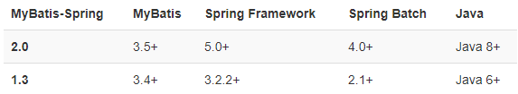

[TOC]

# 第一节 Spring 和 Mybatis 整合

## 1、思路


## 2、Mybatis-Spring技术

[官方介绍](http://mybatis.org/spring/zh/index.html)

相关技术之间版本匹配说明：




Mybatis-Spring 的依赖：

```xml
<!-- https://mvnrepository.com/artifact/org.mybatis/mybatis-spring -->
<dependency>
    <groupId>org.mybatis</groupId>
    <artifactId>mybatis-spring</artifactId>
    <version>2.0.6</version>
</dependency>
```


## 3、总体 SSM 整合所需依赖

```xml
<!-- SpringMVC -->
<dependency>
    <groupId>org.springframework</groupId>
    <artifactId>spring-webmvc</artifactId>
    <version>5.3.1</version>
</dependency>
 
<!-- Spring 持久化层所需依赖 -->
<dependency>
    <groupId>org.springframework</groupId>
    <artifactId>spring-orm</artifactId>
    <version>5.3.1</version>
</dependency>
 
<!-- 日志 -->
<dependency>
    <groupId>ch.qos.logback</groupId>
    <artifactId>logback-classic</artifactId>
    <version>1.2.3</version>
</dependency>
 
<!-- ServletAPI -->
<dependency>
    <groupId>javax.servlet</groupId>
    <artifactId>javax.servlet-api</artifactId>
    <version>3.1.0</version>
    <scope>provided</scope>
</dependency>
 
<!-- Spring5和Thymeleaf整合包 -->
<dependency>
    <groupId>org.thymeleaf</groupId>
    <artifactId>thymeleaf-spring5</artifactId>
    <version>3.0.12.RELEASE</version>
</dependency>
 
<!-- Mybatis核心 -->
<dependency>
    <groupId>org.mybatis</groupId>
    <artifactId>mybatis</artifactId>
    <version>3.5.7</version>
</dependency>
 
<!-- MySQL驱动 -->
<dependency>
    <groupId>mysql</groupId>
    <artifactId>mysql-connector-java</artifactId>
    <version>5.1.3</version>
</dependency>
 
<!-- 数据源 -->
<dependency>
    <groupId>com.alibaba</groupId>
    <artifactId>druid</artifactId>
    <version>1.0.31</version>
</dependency>
 
<!-- junit5 -->
<dependency>
    <groupId>org.junit.jupiter</groupId>
    <artifactId>junit-jupiter-api</artifactId>
    <version>5.7.0</version>
    <scope>test</scope>
</dependency>
 
<!-- Spring 的测试功能 -->
<dependency>
    <groupId>org.springframework</groupId>
    <artifactId>spring-test</artifactId>
    <version>5.3.1</version>
</dependency>
 
<!-- Mybatis 和 Spring 的整合包 -->
<dependency>
    <groupId>org.mybatis</groupId>
    <artifactId>mybatis-spring</artifactId>
    <version>2.0.6</version>
</dependency>
```


## 4、配置数据源

### ①创建 jdbc.properties

```properties
jdbc.user=root
jdbc.password=atguigu
jdbc.url=jdbc:mysql://192.168.198.100:3306/mybatis-example
jdbc.driver=com.mysql.jdbc.Driver
```


### ②加入日志配置文件


### ③创建 Spring 配置文件


```xml
<!-- 加载外部属性文件 -->
<context:property-placeholder location="classpath:jdbc.properties"/>
 
<!-- 配置数据源 -->
<bean id="druidDataSource" class="com.alibaba.druid.pool.DruidDataSource">
    <property name="username" value="${jdbc.user}"/>
    <property name="password" value="${jdbc.password}"/>
    <property name="driverClassName" value="${jdbc.driver}"/>
    <property name="url" value="${jdbc.url}"/>
</bean>
```


### ④创建 junit 测试类

```java
@SpringJUnitConfig(locations = {"classpath:spring-persist.xml"})
public class SSMTest {
 
    @Autowired
    private DataSource dataSource;
 
    Logger logger = LoggerFactory.getLogger(getClass());
 
    @Test
    public void testConn() throws SQLException {
        Connection connection = dataSource.getConnection();
        logger.debug(connection.toString());
    }
 
}
```


## 5、配置 SqlSessionFactoryBean

### ①创建 Mybatis 全局配置文件


```xml
<?xml version="1.0" encoding="UTF-8" ?>
<!DOCTYPE configuration
        PUBLIC "-//mybatis.org//DTD Config 3.0//EN"
        "http://mybatis.org/dtd/mybatis-3-config.dtd">
<configuration>
 
    <!-- Mybatis全局配置 -->
    <settings>
        <!-- 将数据库表字段映射到驼峰式命名的Java实体类属性中 -->
        <!-- 数据库表字段格式：单词_单词 -->
        <!-- Java实体类属性：首字母小写的驼峰式命名 -->
        <setting name="mapUnderscoreToCamelCase" value="true"/>
    </settings>
 
</configuration>
```


### ②创建模型

```java
public class Emp {
 
    private Integer empId;
    private String empName;
    private Double empSalary;
```


### ③创建Mapper接口

```java
public interface EmpMapper {
 
    List<Emp> selectAll();
 
}
```


### ④创建Mapper配置文件

```xml
<?xml version="1.0" encoding="UTF-8" ?>
<!DOCTYPE mapper
        PUBLIC "-//mybatis.org//DTD Mapper 3.0//EN"
        "http://mybatis.org/dtd/mybatis-3-mapper.dtd">
 
<!-- mapper是根标签。namespace属性是找到当前配置的依据 -->
<!-- 由于最理想的Mybatis使用方式是：通过Mapper接口调用接口方法，访问数据库 -->
<!-- 这样的理想方式要求：能够通过接口全类名找到Mapper配置 -->
<!-- 所以：我们就用Mapper接口的全类名来给namespace属性赋值 -->
<mapper namespace="com.atguigu.ssm.mapper.EmpMapper">
 
    <!-- List<Emp> selectAll(); -->
    <select id="selectAll" resultType="Emp">
        select emp_id,emp_name,emp_salary from t_emp
    </select>
 
</mapper>
```


### ⑤配置 SqlSessionFactoryBean

#### [1]风格一：保留 Mybatis 全局配置文件

```xml
<!-- 配置 SqlSessionFactoryBean -->
<bean id="sqlSessionFactory" class="org.mybatis.spring.SqlSessionFactoryBean">
 
    <!-- 指定 Mybatis 全局配置文件位置 -->
    <property name="configLocation" value="classpath:mybatis-config.xml"/>
 
    <!-- 指定 Mapper 配置文件位置 -->
    <property name="mapperLocations" value="classpath:mappers/*Mapper.xml"/>
 
    <!-- 装配数据源 -->
    <property name="dataSource" ref="druidDataSource"/>
 
</bean>
```


#### [2]风格二：彻底舍弃 Mybatis 全局配置文件

```xml
<!-- 配置 SqlSessionFactoryBean -->
<bean id="sqlSessionFactory" class="org.mybatis.spring.SqlSessionFactoryBean">
 
    <!-- 舍弃 Mybatis 全局配置文件，使用 configuration 属性 -->
    <property name="configuration">
        <bean class="org.apache.ibatis.session.Configuration">
            <property name="mapUnderscoreToCamelCase" value="true"/>
        </bean>
    </property>
 
    <!-- 舍弃 Mybatis 全局配置文件，使用 typeAliasesPackage 属性配置实体类所在包 -->
    <property name="typeAliasesPackage" value="com.atguigu.ssm.entity"/>
 
    <!-- 指定 Mapper 配置文件位置 -->
    <property name="mapperLocations" value="classpath:mappers/*Mapper.xml"/>
 
    <!-- 装配数据源 -->
    <property name="dataSource" ref="druidDataSource"/>
 
</bean>
```


注意：上面两种方式如果并存，会抛出异常：

> java.lang.IllegalStateException: Property 'configuration' and 'configLocation' can not specified with together


### ⑥配置 Mapper 接口扫描器

#### [1]方式一：使用扫描器

```xml
<!-- 配置 Mapper 接口类型的bean的扫描器 -->
<bean id="mapperScannerConfigurer" class="org.mybatis.spring.mapper.MapperScannerConfigurer">
    <property name="basePackage" value="com.atguigu.ssm.mapper"/>
</bean>
```


#### [2]方式二：使用 mybatis-spring 名称空间

```xml
<mybatis-spring:scan base-package="com.atguigu.ssm.mapper"/>
```


### ⑦测试

```java
@Autowired
private EmpMapper empMapper;
 
@Test
public void testMybatis() {
    List<Emp> empList = empMapper.selectAll();
 
    for (Emp emp : empList) {
        logger.debug(emp.toString());
    }
}
```


## 6、加入声明式事务

### ①配置事务管理器

```xml
<!-- 配置事务管理器 -->
<bean id="transactionManager" class="org.springframework.jdbc.datasource.DataSourceTransactionManager">
    <!-- 装配数据源 -->
    <property name="dataSource" ref="druidDataSource"/>
</bean>
 
<!-- 开启基于注解的声明式事务 -->
<tx:annotation-driven transaction-manager="transactionManager"/>
```


### ②测试

#### [1]创建 Service 组件


```java
@Service
public class EmpServiceImpl implements EmpService {
 
    @Autowired
    private EmpMapper empMapper;
 
    @Override
    @Transactional(readOnly = true)
    public List<Emp> getAll() {
        return empMapper.selectAll();
    }
}
```


#### [2]配置自动扫描的包


```xml
<context:component-scan base-package="com.atguigu.ssm.service"/>
```


#### [3]测试

```java
@Autowired
private EmpService empService;
 
@Test
public void testTx() {
    List<Emp> empList = empService.getAll();
    for (Emp emp : empList) {
        System.out.println("emp = " + emp);
    }
}
```


[回目录](index.html) [下一节](verse02.html)