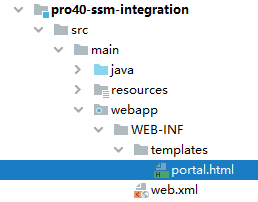
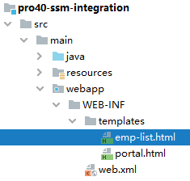

[TOC]

# 第二节 Spring 和 SpringMVC 整合

## 1、本质

- ContextLoaderListener：读取 spring-persist.xml
- DispatcherServlet：读取 spring-mvc.xml


## 2、web.xml配置

```xml
<!-- ContextLoaderListener -->
<!-- 通过 context-param 指定 Spring 框架的配置文件位置 -->
<context-param>
    <param-name>contextConfigLocation</param-name>
    <param-value>classpath:spring-persist.xml</param-value>
</context-param>
 
<!-- 配置 ContextLoaderListener 监听器 -->
<listener>
    <listener-class>org.springframework.web.context.ContextLoaderListener</listener-class>
</listener>
 
<!-- DispatcherServlet -->
<servlet>
    <servlet-name>dispatcherServlet</servlet-name>
    <servlet-class>org.springframework.web.servlet.DispatcherServlet</servlet-class>
    <init-param>
        <param-name>contextConfigLocation</param-name>
        <param-value>classpath:spring-mvc.xml</param-value>
    </init-param>
    <load-on-startup>1</load-on-startup>
</servlet>
<servlet-mapping>
    <servlet-name>dispatcherServlet</servlet-name>
    <url-pattern>/</url-pattern>
</servlet-mapping>
 
<!-- 需要注意两个 Filter 的顺序：字符集过滤器在前，转换请求方式过滤器在后 -->
<!-- CharacterEncodingFilter -->
<filter>
    <filter-name>characterEncodingFilter</filter-name>
    <filter-class>org.springframework.web.filter.CharacterEncodingFilter</filter-class>
    <init-param>
        <param-name>encoding</param-name>
        <param-value>UTF-8</param-value>
    </init-param>
    <init-param>
        <param-name>forceRequestEncoding</param-name>
        <param-value>true</param-value>
    </init-param>
    <init-param>
        <param-name>forceResponseEncoding</param-name>
        <param-value>true</param-value>
    </init-param>
</filter>
<filter-mapping>
    <filter-name>characterEncodingFilter</filter-name>
    <url-pattern>/*</url-pattern>
</filter-mapping>
 
<!-- HiddenHttpMethodFilter -->
<filter>
    <filter-name>hiddenHttpMethodFilter</filter-name>
    <filter-class>org.springframework.web.filter.HiddenHttpMethodFilter</filter-class>
</filter>
<filter-mapping>
    <filter-name>hiddenHttpMethodFilter</filter-name>
    <url-pattern>/*</url-pattern>
</filter-mapping>
```


## 3、SpringMVC 配置

```xml
<!-- SpringMVC 只扫描 handler 类所在的包 -->
<!-- Spring 和 SpringMVC 扫描各自负责的组件，扫描的范围没有重合的部分，直接避免了重复创建对象 -->
<context:component-scan base-package="com.atguigu.ssm.handler"/>
 
<!-- 配置 Thymeleaf 的视图解析器 -->
<bean id="thymeleafViewResolver" class="org.thymeleaf.spring5.view.ThymeleafViewResolver">
    <property name="order" value="1"/>
    <property name="characterEncoding" value="UTF-8"/>
    <property name="templateEngine">
        <bean class="org.thymeleaf.spring5.SpringTemplateEngine">
            <property name="templateResolver">
                <bean class="org.thymeleaf.spring5.templateresolver.SpringResourceTemplateResolver">
                    <property name="prefix" value="/WEB-INF/templates/"/>
                    <property name="suffix" value=".html"/>
                    <property name="characterEncoding" value="UTF-8"/>
                    <property name="templateMode" value="HTML5"/>
                </bean>
            </property>
        </bean>
    </property>
</bean>
 
<!-- SpringMVC 注解驱动（标配） -->
<mvc:annotation-driven/>
 
<!-- 对于没有映射的请求直接转发放行，主要是静态资源 -->
<mvc:default-servlet-handler/>
 
<!-- 匹配请求路径直接前往视图，不经过 handler 方法 -->
<mvc:view-controller path="/" view-name="portal"/>
<mvc:view-controller path="/index.html" view-name="portal"/>
```


## 4、创建组件


```java
@Controller
public class EmpHandler {
 
    @Autowired
    private EmpService empService;
     
    @RequestMapping("/get/all")
    public String getAll(Model model) {
 
        // 1、查询数据
        List<Emp> empList = empService.getAll();
         
        // 2.存入模型
        model.addAttribute("empList", empList);
 
        return "emp-list";
    }
 
}
```


## 5、页面操作

### ①首页超链接



```html
<a th:href="@{/get/all}">显示全部数据</a>
```


### ②显示数据的页面



```html
<table>
    <tr>
        <th>ID</th>
        <th>NAME</th>
        <th>SALARY</th>
    </tr>
    <tbody th:if="${#lists.isEmpty(empList)}">
        <tr>
            <td colspan="3">抱歉！没有查询到数据！</td>
        </tr>
    </tbody>
    <tbody th:if="${not #lists.isEmpty(empList)}">
        <tr th:each="emp : ${empList}">
            <td th:text="${emp.empId}">这里显示员工ID</td>
            <td th:text="${emp.empName}">这里显示员工NAME</td>
            <td th:text="${emp.empSalary}">这里显示员工SALARY</td>
        </tr>
    </tbody>
</table>
 
<a th:href="@{/}">回首页</a>
```


[上一节](verse01.html) [回目录](index.html) [下一节](verse03.html)