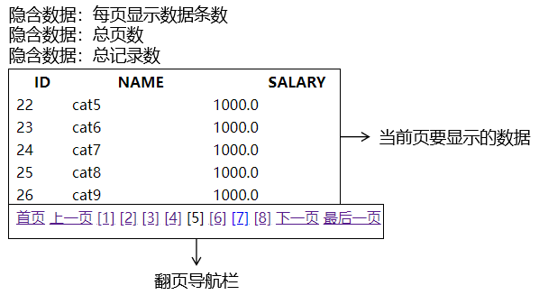

[TOC]

# 第三节 分页

## 1、提出问题

如果应用程序显示数据不分页，会有三个问题：

- 用户查看数据非常不方便。
- 所有数据不分冷热全部显示出来，冷数据白白占用存储空间，浪费内存。
- 在服务器端查询全部数据占用内存很大，给整个系统增加了很大压力。


## 2、分页的概念

### ①分页本身的概念

把系统中要显示的数据分成较小的单元，每个单元作为『一页』显示给用户。每次访问服务器只查询一页数据。

分页的好处：

- 用户体验较好。
- 服务器端每次只查询一部分数据，内存压力减小。
- 对冷数据减少查询的次数，据此对系统性能进行优化。


### ②分页的细节




## 3、实现分页的基本逻辑

### ①物理分页

具体数据库不同，分页语法有区别。下面我们以 MySQL 为例来说明。MySQL 的分页需要借助 LIMIT 子句来完成。

```sql
select emp_id,emp_name,emp_salary from t_emp limit 0,5; # 查询第一页数据
select emp_id,emp_name,emp_salary from t_emp limit 5,5; # 查询第二页数据
select emp_id,emp_name,emp_salary from t_emp limit 10,5;# 查询第三页数据
```


LIMIT 子句的公式：

> limit (pageNo-1)*pageSize,pageSize


注意：在 SQL 的语法中，LIMIT 子句必须出现在 SQL 语句最后。


### ②逻辑分页

#### [1]需求

为了能够在页面上全面显示分页相关的细节数据，总页数需要计算得到。


#### [2]总页数计算方式


#### [3]页码的合理化

页码的有效范围：1~总页数。修正方式：

- 用户输入的页码 < 1：将页码设定为第一页
- 用户输入的页码 > 总页数：将页码设定为最后一页


### ③分页执行流程

- 查询总记录数
- 查询当前页数据
- 根据总记录数和每页条数计算总页数
- 在1~总页数之间修正页码
- 封装上述所有数据，发送到页面显示


## 4、Mybatis 的分页插件

具体使用细节可以参考：[官方文档](https://github.com/pagehelper/Mybatis-PageHelper/blob/master/wikis/zh/HowToUse.md)


### ①依赖

```xml
<!-- https://mvnrepository.com/artifact/com.github.pagehelper/pagehelper -->
<dependency>
    <groupId>com.github.pagehelper</groupId>
    <artifactId>pagehelper</artifactId>
    <version>5.2.0</version>
</dependency>
```


### ②配置

```xml
<!-- 配置 SqlSessionFactoryBean -->
<bean id="sqlSessionFactory" class="org.mybatis.spring.SqlSessionFactoryBean">
 
    ……
 
    <!-- 在 plugins 属性中配置 Mybatis 插件 -->
    <property name="plugins">
        <array>
            <bean class="com.github.pagehelper.PageInterceptor">
                <property name="properties">
                    <props>
                        <!-- 设置 reasonable 为 true 表示将页码进行合理化修正。页码的有效范围：1~总页数 -->
                        <prop key="reasonable">true</prop>
                        
                        <!-- 数据库方言：同样都是 SQL 语句，拿到不同数据库中，在语法上会有差异 -->
                        <!-- 默认情况下，按照 MySQL 作为数据库方言来运行 -->
                        <prop key="helperDialect">mysql</prop>
                    </props>
                </property>
            </bean>
        </array>
    </property>
 
</bean>
```


## 5、实现分页功能

### ①首页超链接

```html
<a th:href="@{/get/page/1}">显示分页数据</a>
```


### ②handler 方法

```java
@RequestMapping("/get/page/{pageNo}")
public String getPage(
        @PathVariable("pageNo") Integer pageNo, 
        Model model) {
 
    // PageInfo 对象封装了和分页相关的所有信息
    PageInfo<Emp> pageInfo = empService.getPageInfo(pageNo);
    
    // 将 PageInfo 对象存入模型
    model.addAttribute("pageInfo", pageInfo);
    
    return "emp-page";
}
```


### ③service 方法

```java
@Override
public PageInfo<Emp> getPageInfo(Integer pageNo) {
 
    // 1、确定每页显示数据的条数
    int pageSize = 5;
 
    // 2、设定分页数据：开启分页功能。开启后，后面执行的 SELECT 语句会自动被附加 LIMIT 子句，
    // 而且会自动查询总记录数
    PageHelper.startPage(pageNo, pageSize);
 
    // 3、正常执行查询
    List<Emp> empList = empMapper.selectAll();
 
    // 4、封装为 PageInfo 对象返回
    return new PageInfo<>(empList);
}
```


### ④页面展示

#### [1]显示数据

```html
……
	<tr th:each="emp : ${pageInfo.list}">
……
```


#### [2]显示翻页导航栏

```html
<span th:if="${pageInfo.hasPreviousPage}">
    <a th:href="@{/get/page/1}">首页</a>
    <a th:href="@{/get/page/}+${pageInfo.prePage}">上一页</a>
</span>
 
<span th:each="navigator : ${pageInfo.navigatepageNums}">
 
    <!-- th:if 判断当前标签是否是当前页 -->
    <!-- 如果不是当前页则显示超链接 -->
    <a th:if="${navigator != pageInfo.pageNum}"
       th:href="@{/get/page/}+${navigator}"
       th:text="'['+${navigator}+']'"></a>
 
    <!-- 如果是当前页则显示页码本身 -->
    <span th:if="${navigator == pageInfo.pageNum}" th:text="'['+${navigator}+']'"></span>
</span>
 
<span th:if="${pageInfo.hasNextPage}">
    <a th:href="@{/get/page/}+${pageInfo.nextPage}">下一页</a>
    <a th:href="@{/get/page/}+${pageInfo.pages}">最后一页</a>
</span>
 
<span th:text="${pageInfo.pageNum}+'/'+${pageInfo.pages}"></span>
```


### ⑤打印的 SQL 语句


## 6、为什么是 PageInfo 而不是 Page

### ①List接口的具体实现

当我们开启了分页功能后，查询一个 List 集合，实际返回的是：com.github.pagehelper.Page 类型。这个 Page 类继承了 ArrayList，所以也兼容 List 接口类型。


### ②提出问题

如果我们将 Page 类型的对象存入模型，转发到视图模板上显示数据，会存在一个问题：视图模板技术只承认这个对象是一个 List 集合，不识别 List 集合之外的其它属性。

这一点在其他场合也需要注意：我们开发时尽量不要继承 ArrayList、HashMap 等类似的集合实现类。如果继承了，那么页面视图模板技术或其他表达式往往只能识别我们的对象是一个集合，而无法访问额外封装的其他属性。

所以 Page 对象需要封装为 PageInfo，让 list、pageNum 等等数据作为 PageInfo 对象的属性；PageInfo 本身并不是一个 List 类型的集合。


### ③PageHelper 非侵入式的体现

```java
PageHelper.startPage(pageNo, pageSize);
```


开启分页功能，就在 SQL 语句后面附加 LIMIT 子句并查询总记录数；不开启就还是按照原样查询。分页功能对原有的 Mapper 接口、SQL 语句没有任何影响。这个效果可以称之为是非侵入式，也可以说是可插拔的。


[上一节](verse02.html) [回目录](index.html)