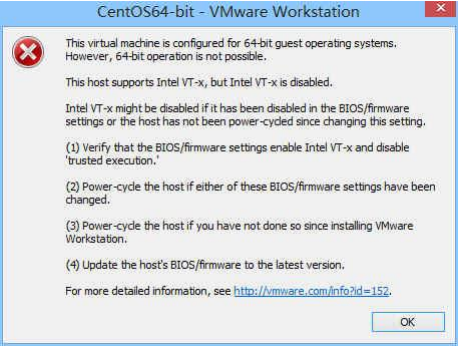
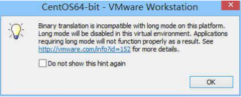
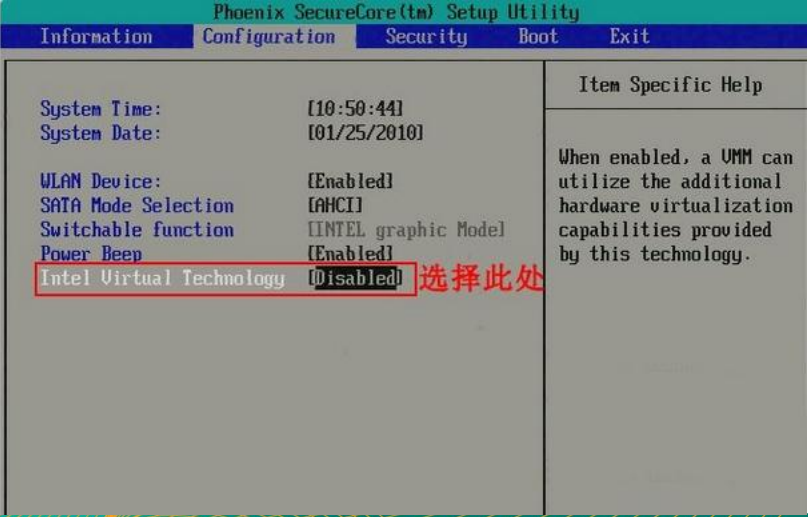
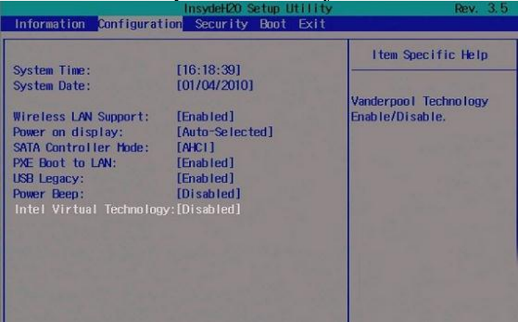

# 第五节 BIOS虚拟化支持问题

## 1、故障现象

启动虚拟机时看到下面这样的错误：

那么就说明当前物理机没有开启虚拟化支持。需要进入BOIS界面打开这个设置。通常出现这个问题的几率是10%左右。

## 2、解决办法

每个不同品牌的电脑进入BIOS的办法都不尽相同，需要根据实际情况反复尝试。而且需要注意的是有的笔记本电脑需要按住Fn键再按F2、F12等等。

Phoenix BIOS机型

Insyde BIOS机型

[上一节](verse04.html)&nbsp;[返回上一级目录](index.html)&nbsp;[下一节](verse06.html)