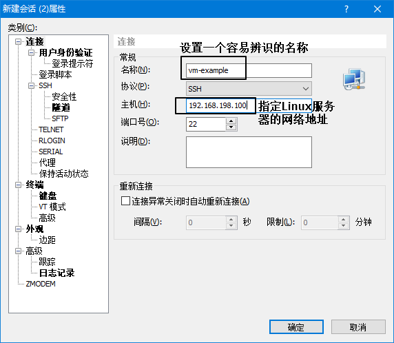
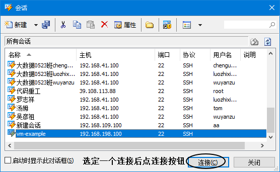
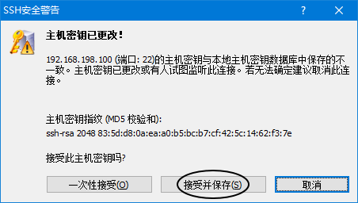
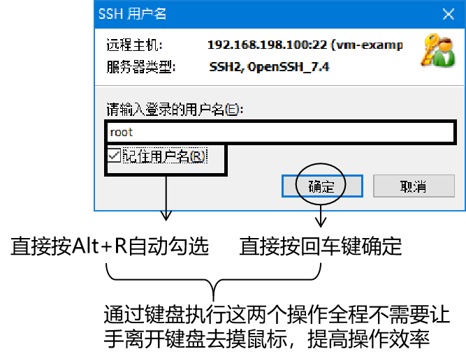
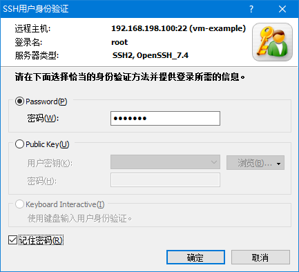
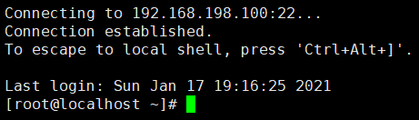
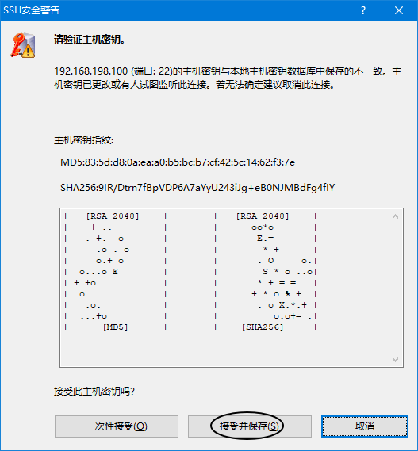
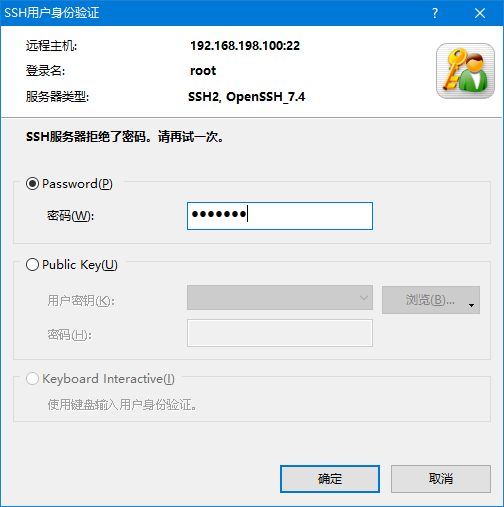
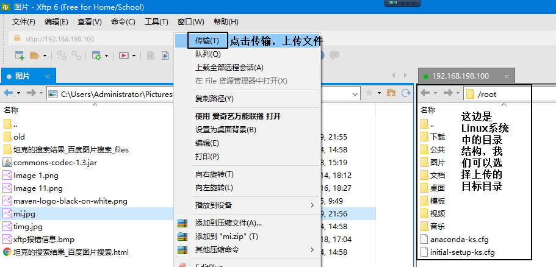

# 第六节 Xshell和Xftp

## 1、Linux系统的远程连接

对我们来说，Linux系统是当服务器来用的。而正式的服务器都需要通过网络远程访问。Linux系统运行了专门的进程基于SSH协议来接受客户端的远程连接。SSH客户端也很多，我们使用的是Xshell和Xftp。其中Xshell用来远程运行Linux命令，Xftp用来向Linux上传文件。

## 2、连接前的准备

### ①确认网络连接

在Windows这边通过ping命令确认从Windows到Linux网络是否连通。

> C:\Users\Administrator>ping 192.168.198.100
>
> 正在 Ping 192.168.198.100 具有 32 字节的数据:
> 来自 192.168.198.100 的回复: 字节=32 时间<1ms TTL=64
> 来自 192.168.198.100 的回复: 字节=32 时间=1ms TTL=64
> 来自 192.168.198.100 的回复: 字节=32 时间=1ms TTL=64
> 来自 192.168.198.100 的回复: 字节=32 时间=2ms TTL=64
>
> 192.168.198.100 的 Ping 统计信息:
>     数据包: 已发送 = 4，已接收 = 4，丢失 = 0 (0% 丢失)，
> 往返行程的估计时间(以毫秒为单位):
>     最短 = 0ms，最长 = 2ms，平均 = 1ms

### ②安装软件

安装Xshell和Xftp这两个软件，可能会需要升级Windows系统的.NET组件或Windows Visual Studio等。

## 3、Xshell的使用

### ①新建连接

### ②连接

点这里调整字体：

下面这样就可以输入Linux命令了：

## 4、Xftp的使用

### ①打开Xftp

由于使用Xshell的频率远高于Xftp，所以最方便的办法从Xshell里打开Xftp。

### ②确认连接信息

[上一节](verse05.html)&nbsp;[返回上一级目录](index.html)