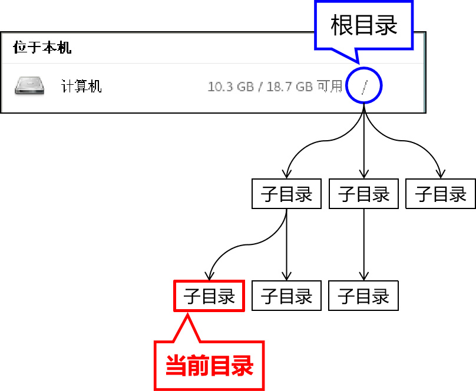

[TOC]

# 第一节 背景知识

## 1、Linux系统中一切皆文件

在Linux系统中任何东西都是以文件形式来存储的。这其中不仅包括我们熟知的文本文件、可执行文件等等，还包括硬件设备、虚拟设备、网络连接等等，甚至连目录其实都是一种特殊的文件。

## 2、Linux文件系统

Linux系统环境下的文件系统与Windows有很大区别。
在Windows中，每一个盘符下是一个独立的文件系统，硬盘有多少个分区就有多少个文件系统。

而在Linux系统中不管创建了多少个硬盘分区都只有一个文件系统。整个文件系统的根目录是“/”，从“/”出发可以找到Linux系统中的所有目录和文件。

## 3、Linux系统中的路径

绝对路径：从“/”根目录开始逐层查找文件和目录。

> /etc/sysconfig/network-scripts
>
> /tmp/vmware-root/vmware-db.pl.2267

相对路径：以当前目录或上一级目录为基准逐层查找文件和目录

> 当前目录：“./”
> 当前目录的上一级目录：“../”

“./”可以省略不写，也同样表示当前目录。

易错点：“/”代表的是最顶层、最上面的那个根目录，不是当前目录啊喂！不是啊！！！

除非你现在所在的位置就是在根目录这里，否则“/”和“./”就完全是两码事啊！加了一个“.”意思就完全不一样了！！！

## 4、用户的家目录

Linux是一个多用户系统，每个登录到系统的用户都需要有一个自己专属的目录保存自己私有的文件。系统当然看到了这个需求，所以每创建一个普通用户，系统就会在/home目录下创建一个和用户同名的目录作为这个用户的家目录。

比如：创建一个名为tom的用户，它的家目录就是/home/tom

可以使用“~”代表用户的家目录。

特殊的是作为系统的超级管理员，root用户的家目录是/root目录。

## 5、文件扩展名不敏感

在Windows系统中，操作系统会负责根据文件扩展名识别文件类型，然后再根据文件类型匹配打开这种文件的应用程序。让用户不必记忆大量的对应关系，用哪个直接打开就好了。

而Linux是一个命令行系统，虽然现在也有了图形化界面，但是还是以命令行使用为主。

所以Linux系统中通常是使用命令去打开文件。而这个命令和文件是否匹配，那就需要运行命令的人自己注意。

## 6、一级目录简介

| 目录名       | 是否重要 | 作用                                                         |
| ------------ | -------- | ------------------------------------------------------------ |
| /bin         |          | bin是binary的缩写，这个目录存放着最经常使用的命令。          |
| /boot        |          | 这里存放的是启动Linux时用到的引导程序文件。                  |
| /dev         |          | device(设备)的缩写，该目录下存放的是Linux的外部设备。        |
| /etc         | √        | 存放系统和第三方应用程序的配置文件。                         |
| /home        | √        | 存放普通用户家目录。                                         |
| /lib和/lib64 |          | 系统开机所需要最基本的动态连接共享库。                       |
| /media       |          | 挂载Linux系统会自动识别的设备，例如U盘、光驱等。             |
| /mnt         |          | 专门用于挂载操作的目录。                                     |
| /opt         | √        | 存放安装第三方应用程序时使用的压缩包文件。                   |
| /proc        |          | 这个目录是一个虚拟的目录，它是系统内存的映射。               |
| /root        | √        | 超级管理员root用户的家目录。                                 |
| /run         |          | 存放进程产生的临时文件，关机重启后会消失。                   |
| /sbin        |          | s是Super User的意思，这里存放的是系统管理员使用的系统管理程序。 |
| /srv         |          | service缩写，该目录存放一些服务启动之后需要提取的数据。      |
| /sys         |          | 该目录下安装了2.6内核中新出现的一个文件系统sysfs。           |
| /tmp         |          | 存放临时文件。                                               |
| /usr         | √        | 应用程序的默认安装目录，类似于Windows下的program files目录。 |
| /var         | √        | 存放经常变化的内容，例如日志文件。                           |

[回目录](index.html) [下一节](verse02-00-index.html)