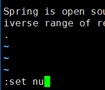
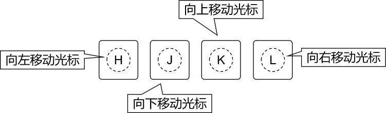
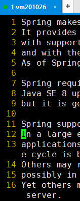
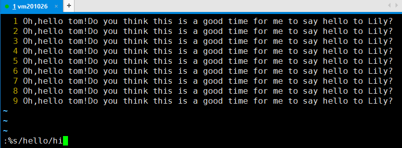
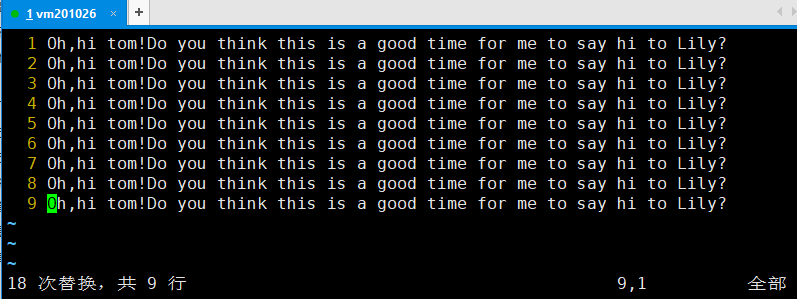

[TOC]

# 第二节 文件和目录相关命令：vim

## 一、简介

命令：vim

作用：在命令行环境下编辑文本文件

提示：在命令行模式下没有鼠标，所以刚开始使用的时候会觉得非常不习惯。但是慢慢的熟练之后你会发现，不需要鼠标全部用键盘就可以操作效率很高。

## 二、三种模式

一般模式：通过按键控制VIM工作

编辑模式：可以自由输入

指令模式：通过执行指令完成一些特殊操作

## 三、基本操作

### 1、打开一个文件

[root@localhost ~]# vim content.txt

即使这个文件不存在也没关系，vim知道我们打算新建一个文件。打开后的效果是：

### 2、进入编辑模式

进入编辑模式有很多种方法，现在我们先使用其中一种方法：按一下i键。

按键的时候屏幕上是不显示“i”这个字母的，这个需要注意。

然后可以随意输入一些内容。

然后再按Esc键回到一般模式。

### 3、显示行号

接着上一步继续，在回到一般模式后，输入英文冒号。我们会看到光标移动到了窗口的底部：

然后输入set nu回车就可以显示行号了。

这时我们其实就使用了一个指令。

### 4、保存已修改的内容

当:set nu这个指令执行完成后，vim就又回到了一般模式。此时我们使用:w指令就可以保存文件。

### 5、退出

使用:q指令就可以退出vim了

### 6、保存退出

:w是保存，:q是退出，:wq就是保存退出

### 7、不保存退出

当我们退出vim时，如果有部分修改还没有保存，那么会看到下面的提示：

当我们想要放弃对文件的修改，不保存直接退出就使用:q!

## 四、看

### 1、上下左右移动光标

#### ①方法一

很容易上手的操作方式，但是距离基准键位较远，熟练使用之后敲击键盘的速度大幅度提升，要移动这么远的举例还是非常不便的。

#### ②方法二

就在基准键位上，非常方便。

### 2、前往指定行

#### ①第一行

输入gg，将光标定位到第一行开头的位置。此时屏幕上并不会显示你输入了什么，需要你自己心里面知道。

#### ②最后一行

输入G，将光标定位到最后一行开头的位置。

#### ③指定行号

假设我们要去第12行，那么依次输入“1”、“2”、“G”即可。这些也不会在屏幕上的任何地方显示，所以还是要我们自己心里清楚。

## 五、改

这里我们说的是在一般模式下通过按键来编辑文件，并不是进入编辑模式。

| 按键   | 效果                                                         |
| ------ | ------------------------------------------------------------ |
| dd     | 删除光标所在的行                                             |
| d5d    | 从光标所在行开始，向下连续删除5行（包括光标所在行）          |
| u      | 撤销刚才的操作                                               |
| Ctrl+r | 重做刚才撤销的操作                                           |
| yy     | 复制光标所在的行                                             |
| p      | 将当前复制的行粘贴到光标所在位置的下一行                     |
| y3y    | 从光标所在行开始，向下连续复制5行（包括光标所在行）          |
| r      | 替换光标所在位置的一个字符 第一步：按一下r键 第二步：输入新的字符 |

## 六、编

这次我们要看看有哪些方法可以进入编辑模式

| 按键 | 大小写 说明 | 光标动作                                                     |
| ---- | ---------------- | ------------------------------------------------------------ |
| i    | 小写             | 不动，就在当前位置，开始输入 |
| I    | 大写             | 移动到行的开头，开始输入 |
| a    | 小写             | 光标向后移动一格，然后开始输入 |
| A    | 大写             | 光标移动到行的末尾，然后开始输入 |
| o    | 小写             | 先在光标所在行的下面插入空行 然后把光标移动到空行的开头，再开始输入 |

## 七、搜

### 1、初始状态

### 2、进入指令模式

输入“/”，进入专门用于搜索关键词的指令模式

### 3、输入关键词

### 4、回车执行搜索

关键词匹配到的内容会被高亮显示

### 5、遍历匹配内容

在匹配到搜索结果后，可以逐个遍历各个匹配内容：

- 输入n向下找
- 输入N向上找

### 6、取消高亮显示

使用:noh指令即可取消高亮

回车执行后的效果如下图所示：

## 八、替

### 1、新建文件

> Oh,hello tom!Do you think this is a good time for me to say hello to Lily?
>
> Oh,hello tom!Do you think this is a good time for me to say hello to Lily?
>
> Oh,hello tom!Do you think this is a good time for me to say hello to Lily?
>
> Oh,hello tom!Do you think this is a good time for me to say hello to Lily?
>
> Oh,hello tom!Do you think this is a good time for me to say hello to Lily?
>
> Oh,hello tom!Do you think this is a good time for me to say hello to Lily?
>
> Oh,hello tom!Do you think this is a good time for me to say hello to Lily?
>
> Oh,hello tom!Do you think this is a good time for me to say hello to Lily?
>
> Oh,hello tom!Do you think this is a good time for me to say hello to Lily?

### 2、执行替换

将to替换为TO

关键词替换指令格式解析：

### 3、效果

这时我们看到每一行只有第一个匹配的内容被替换了，后面的没有被替换。这是因为对正则表达式来说，它是以行为单位查找匹配的内容。每一行只要找到第一个匹配那么就可以判断这一行就是匹配的，没有必要继续向后查找了。如果我们需要将一行中的每一个匹配都替换，可以在指令后加/g

### 4、重新替换

先按u键撤销刚才的替换

重新运行替换指令：

效果：

## 九、常见问题

### 1、另一种形式的指令模式

#### ①出现的原因

想进入指令模式时本该先输入冒号，再输入字母。而如果先输入了字母再输入冒号就会看到上面显示的界面。这其实也是正常的指令模式，上面列出了我们执行过的指令，也可以输入新指令。

#### ②输入新指令

按照进入编辑模式的方式，按对应的键即可，比如按一下i键，下面显示“——插入——”，此时就可以在光标位置输入新的指令了。

输入新指令后回车执行。

#### ③选择历史指令

按上、下键即可在指令历史中选择一个具体指令。

#### ④什么都不做直接离开

直接回车即可。

### 2、提示存在交换文件

#### ①产生原因

vim在打开一个文件的时候会同时创建一个临时文件，命名方式是“.原文件名.swp”，这就是所谓的交换文件。而当vim正常退出时，这个交换文件会被删除。所以如果正常操作我们是看不到这个提示界面的。

而之所以会出现上面的提示，是因为当前的vim命令在创建新的交换文件之前就已经检测到了已存在的交换文件。

再往前推理一步，为什么会有交换文件残留？

- 可能原因1：其他窗口正在使用vim打开同一个文件
- 可能原因2：非正常关机等原因导致vim没有正常退出

#### ②解决办法

先根据最下面的提示输入Q退出，然后检查是否在其他窗口已经用vim打开了这个文件：

- 是：继续在这个vim中编辑文件。
- 否：删除交换文件，重新编辑。

### 3、屏幕被锁

在Windows环境下大家已经习惯了使用Ctrl+s保存文档，但是在Linux环境下Ctrl+s是锁屏。如果是因为Ctrl+s锁屏那么可以使用Ctrl+q解锁，然后继续操作。

[上一条](verse02-09-rm.html) [回目录](verse02-00-index.html) [下一条](verse02-11-cat.html)