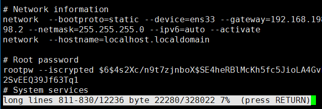

[TOC]

# 第二节 文件和目录相关命令：less

## 1、简介

命令：less

作用：分屏查看文件内容

## 2、用法

### ①使用less命令打开文件

> [root@localhost ~]# less long

### ②less环境

### ③控制方式

| 按键    | 效果                           |
| ------- | ------------------------------ |
| 空格    | 向下滚动一屏                   |
| b       | 向上滚动一屏                   |
| 回车    | 向下滚动一行                   |
| q       | 退出                           |
| /关键词 | 搜索 n向下找 N向上找 |
| =       | 显示详细的文件信息             |

下图是显示详细文件信息的效果：

下图是显示到达文件末尾时的效果：

[上一条](verse02-11-cat.html) [回目录](verse02-00-index.html) [下一条](verse02-13-tail.html)