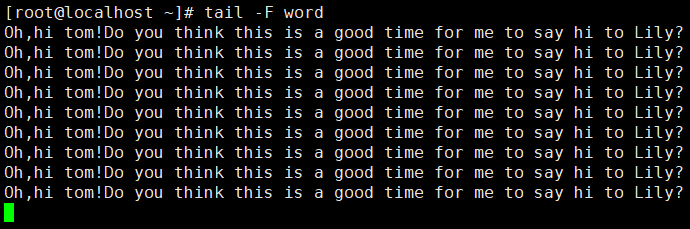
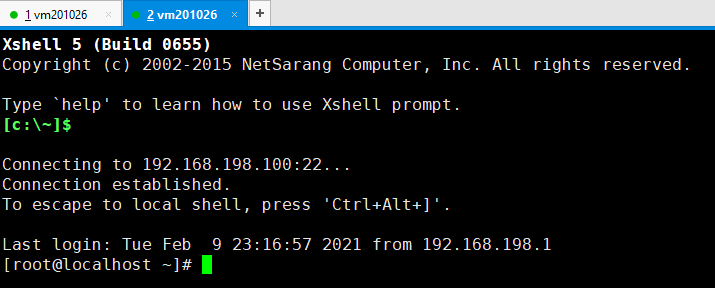

[TOC]

# 第二节 文件和目录相关命令：tail

## 1、简介

命令：tail

效果：显示文件末尾的部分内容

## 2、基本用法

查看文件末尾5行的内容：

## 3、高级用法

实时查看文件末尾新增的内容：

新开一个窗口编辑这个文件：

用vim打开tail命令正在监控的文件：

在文件末尾新增内容并保存：

此时在tail命令所在的窗口下查看实时监控：

使用Ctrl+c退出实时监控。

[上一条](verse02-12-less.html) [回目录](verse02-00-index.html) [下一条](verse02-14-find.html)