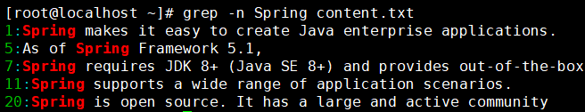

[TOC]

# 第二节 文件和目录相关命令：grep

## 1、基本用法

命令：grep

作用：将文件内容中匹配的行返回

用法：grep 参数 查找内容 源文件

> 补充：grep命令的关键词匹配和vim中的关键词搜索的区别
>
> - vim需要打开文件进入到vim命令自己的界面中而grep命令不需要
>
> - grep命令显示搜索结果时可以将匹配行抽取出来显示，而vim是在全部文件内容中把关键词高亮显示
>
> - grep命令可以同时搜索多个文件
>
>   
>
> - grep命令还有很多更丰富的其他用法
>
> 总之：同一个需求可以通过很多不同的路径来达到，谁也不能说有了面包就不许吃蛋糕。

## 2、特殊用法

下面我们要返回不匹配的行

### ①原始文件

### ②返回匹配的行并显示行号

### ③返回不匹配的行并显示行号

### ④结论

grep命令使用-v参数可以返回不匹配的行

[上一条](verse02-15-locate.html) [回目录](verse02-00-index.html) [下一条](verse02-17-pipe.html)