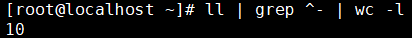

[TOC]

# 第二节 文件和目录相关命令：管道

## 1、概述

管道不是命令，而是一个符号：“|”。它的用法是：命令A | 命令B。作用是把命令A的输出作为命令B的输入。

## 2、举例

### ①需求

显示当前目录下的所有文件。如果使用“ll”命令那么文件和目录都会显示出来。

### ②文件和目录的特征

在显示的详细信息中，文件是以“-”开头的，目录是以“d”开头的。

### ③按照特征编写正则表达式

匹配以“-“开头的行：^-

### ④完整的命令

### ⑤工作机制解析

### ⑥管道可以多重使用

wc -l命令可以统计文本数据的行数

[上一条](verse02-16-grep.html) [回目录](verse02-00-index.html) [下一条](verse02-18-tar.html)