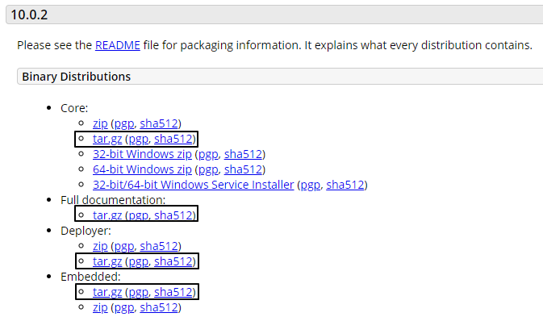
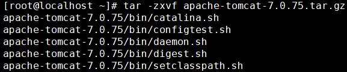

[TOC]

# 第二节 文件和目录相关命令：tar

## 1、简介

在Linux系统环境中，很多程序安装包都是以tar包的形式提供下载的：

所以通常我们需要从官网下载这些tar包，再上传到Linux服务器上，然后在Linux系统内解压。

## 2、tar包解压命令

> tar -zxvf tar包路径

默认解压到当前目录下，如果当前目录下有同名的目录或文件会被直接覆盖，没有任何提示，这一点请大家注意。

参数作用说明：

| 参数名称 | 作用                              |
| -------- | --------------------------------- |
| -z       | 用 gzip 对存档压缩或解压          |
| -x       | 解压                              |
| -v       | 详细显示处理的文件                |
| -f       | 指定存档或设备 (缺省为 /dev/rmt0) |

[上一条](verse02-17-pipe.html) [回目录](verse02-00-index.html) [下一节](verse03-00-index.html)