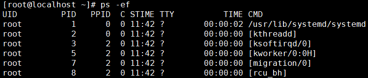
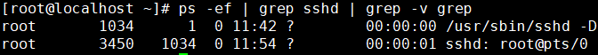

[TOC]

# 第三节 进程相关命令：ps

## 1、简介

命令：ps

对应单词：process status

作用：查看当前正在运行的进程

常用参数组合：ps -ef

-e参数：对应单词entire，表示全部。具体指显示系统中全部的进程信息。

-f参数：对应单词full-formate，表示完整格式。

效果：

## 2、进程信息中各列数据说明

| 列名                                                   | 含义                                                     |
| ------------------------------------------------------ | -------------------------------------------------------- |
| UID                                                    | 进程的用户信息                                           |
| PID  | 进程id。由系统分配，不会重复。                           |
| PPID | 父进程的id。父进程和子进程的关系是：父进程启动了子进程。 |
| CMD  | 当前进程所对应的程序。                                   |
| C                                                      | 用整数表示的CPU使用率                                    |
| STIME                                                  | 进程启动时间                                             |
| TTY                                                    | 进程所在终端。所谓终端就是用户输入命令的操作界面。       |
| TIME                                                   | 进程所占用的CPU时间                                      |

## 3、父进程和子进程之间的关系

简单来说，父进程和子进程的关系是：父进程启动了子进程。我们可以使用pstree命令查看整个进程树。

## 4、和其他命令配合

### ①分屏查看进程信息

全部进程的信息太多了，一屏无法全部显示，所以我们希望可以分屏显示并由我们来控制翻页。为了达到这个目标，我们可以使用管道符号将ps -ef命令的输出数据传送给less命令。

> ps -ef | less

### ②精确查询一个具体进程信息

我们通过Xshell远程连接Linux系统，靠的是sshd这个服务。这个服务如果正在运行中，那么一定会有这个服务对应的进程。所以下面我们来查询一下sshd这个命令的进程。

我们看到这里返回了3条结果，其中前两天都是和sshd服务相关的结果，但是最后一条不是。

> root      72826   3456  0 20:06 pts/0    00:00:00 grep --color=auto sshd

仔细观察一下就能发现，这其实是grep命令本身。因为grep命令运行过程中本身也是一个进程，“grep sshd”正好也匹配sshd，所以就被选中了。但是这是一个干扰项，并不是我们真正要查询的内容，所以需要把它从查询结果中排除。

再用一层管道，使用grep命令的-v参数把匹配grep的行排除，返回不匹配的结果，这就是我们最终想要的。

[上一节](verse02-00-index.html) [回目录](verse03-00-index.html) [下一条](verse03-02-kill.html)