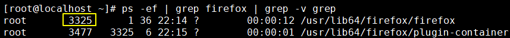

[TOC]

# 第三节 进程相关命令：kill

## 1、简介

命令：kill

作用：杀死进程

说明：kill命令本质上是给进程发送信号。

## 2、举例

### ①打开火狐浏览器

在Linux系统中打开Linux系统自带的火狐浏览器。

### ②查看火狐浏览器的进程id

另外一个是浏览器插件，不用管。

### ③使用kill命令结束火狐浏览器进程

> kill -s kill 3325

另一种写法是

> kill -9 3325

上面两种写法本质上都是发送kill信号给火狐浏览器进程。

[上一条](verse03-01-ps.html) [回目录](verse03-00-index.html) [下一条](verse03-03-top.html)