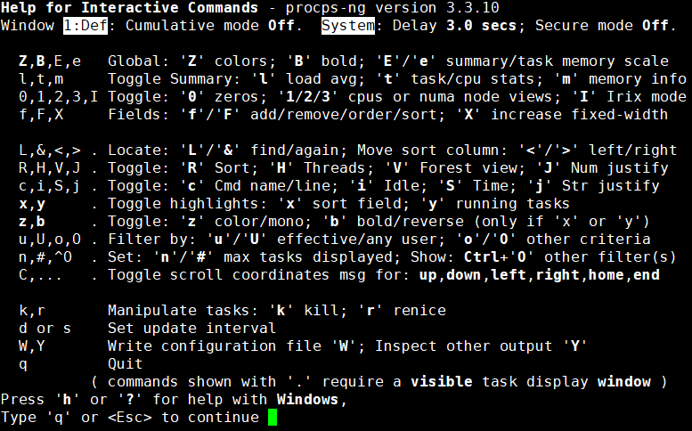

[TOC]

# 第三节 进程相关命令：top

## 1、简介

命令：top

作用：实时查看系统运行情况和健康状态。

## 2、细节

### ①命令与参数

| 命令名 | 更新时间间隔（秒） | 不显示任何闲置或者僵死进程 | 通过进程id监控单一进程 |
| ------ | ------------------ | -------------------------- | ---------------------- |
| top    | -d 间隔秒数        | -i                         | -p 进程id              |

### ②操作控制

| 按键 | 功能                             |
| ---- | -------------------------------- |
| P    | 默认值，根据CPU使用率排序        |
| M    | 以内存的使用率排序               |
| N    | 以PID排序                        |
| d    | 设置数据刷新的时间间隔，单位是秒 |
| q    | 退出                             |

在top命令模式下按h键会显示如下的帮助信息：

### ③查询结果字段解释

#### [1]第一行信息为任务队列信息

| 内容举例                      | 说明                                                         |
| ----------------------------- | ------------------------------------------------------------ |
| 12:26:49                      | 系统当前时间                                                 |
| up 1 day, 13:32               | 系统的运行时间，前面例子表示本机已经运行1天13小时32分钟      |
| 2 users                       | 当前登录了2个用户                                            |
| load average:0.00, 0.00, 0.00 | 系统在之前1分钟，5分钟，15分钟的平均负载。 一般认为小于1时，负载较小。如果大于1，系统已经超出负荷。 |

#### [2]第二行为进程信息

| 内容举例        | 说明                                      |
| --------------- | ----------------------------------------- |
| Tasks: 95 total | 系统中的进程总数                          |
| 1 running       | 正在运行的进程数                          |
| 94 sleeping     | 睡眠的进程                                |
| 0 stopped       | 正在停止的进程                            |
| 0 zombie        | 僵尸进程。如果不是0，需要手工检查僵尸进程 |

#### [3]第三行为CPU信息

| 内容举例      | 说明                                                         |
| ------------- | ------------------------------------------------------------ |
| Cpu(s):0.1%us | 用户空间占用的CPU百分比，us对应user                          |
| 0.1%sy        | 内核空间占用的CPU百分比，sy对应system                        |
| 0.0%ni        | 改变过优先级的进程占用的CPU百分比，ni对应niced               |
| 99.7%id       | 空闲CPU的CPU百分比                                           |
| 0.1%wa        | 等待输入/输出的进程的占用CPU百分比，wa对应IO wait            |
| 0.0%hi        | 硬中断请求服务占用的CPU百分比，hi对应hardware IRQ            |
| 0.1%si        | 软中断请求服务占用的CPU百分比，si对应software IRQ            |
| 0.0%st        | st（Steal time）虚拟时间百分比，也叫被hypervisor偷走的时间。 就是当有虚拟机时，虚拟CPU等待实际CPU的时间百分比。 |

#### [4]第四行为物理内存信息

| 内容举例          | 说明                   |
| ----------------- | ---------------------- |
| 2031912 total     | 物理内存的总量，单位KB |
| 70496 free        | 空闲的物理内存数量     |
| 1780676 used      | 已经使用的物理内存数量 |
| 174864 buff/cache | 作为缓冲的内存数量     |

使用中的内存总量（used）指的是现在系统内核控制的内存数，空闲内存总量（free）是还未纳入内核管控范围的数量。

纳入内核管理的内存不见得都在使用中，还包括过去使用过的现在可以被重复利用的内存，内核并不把这些可被重新使用的内存还给free，因此Linux系统运行过程中free内存会越来越少，但不影响系统运行。因为这表示更多的空闲内存被内核管理了。

#### [5]第五行为交换分区（swap）信息

| 内容举例        | 说明                                             |
| --------------- | ------------------------------------------------ |
| 2097148 total   | 交换分区（虚拟内存）的总大小                     |
| 1137824 free    | 空闲交换分区的大小                               |
| 959324 used     | 已经使用的交互分区的大小                         |
| 58640 avail Mem | 在不交换的情况下，对启动新应用程序可用内存的估计 |

交换分区是一个非常值得关注的地方，如果swap区的used数值持续发生变化那么说明在内核和交换分区之间正在持续发生数据交换，这表示内存不够用了——必须不断把内存中的数据保存到硬盘上。

[上一条](verse03-02-kill.html) [回目录](verse03-00-index.html) [下一条](verse03-04-netstat.html)