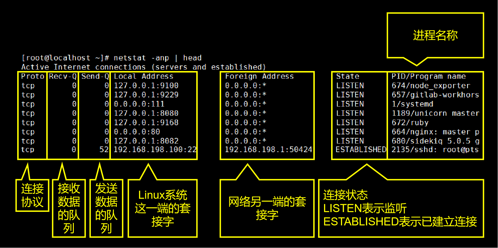

[TOC]

# 第三节 进程相关命令：netstat

## 1、简介

命令：netstat

对应单词：net status

作用：查看网络状态

常用参数：netstat -anp

| 参数名 | 作用                                             |
| ------ | ------------------------------------------------ |
| -a     | 显示所有正在或不在侦听的套接字。                 |
| -n     | 显示数字形式地址而不是去解析主机、端口或用户名。 |
| -p     | 显示套接字所属进程的PID和名称。                  |

## 2、说明

netstat命令显示的网络状态信息包含两部分内容：

- 本机和外网的连接状态信息
- 本机系统内部进程间通信信息

### ①网络连接信息

字段含义说明：

### ②进程间通信信息

我们重点关注的是网络连接信息。

## 3、使用技巧

### ①分屏查看

> netstat -anp | less

### ②根据进程名称查看网络状态

> netstat -anp | grep sshd

### ③根据端口号查看网络状态

> netstat -anp | grep :22

这里需要注意一下，端口号本身就是一串数字，进程id也是一串数字。那么根据端口号匹配时，很多无关的进程id也会被匹配到，造成大量不必要的干扰。此时给端口号数字前加上冒号就好多了。

[上一条](verse03-03-top.html) [回目录](verse03-00-index.html) [下一节](verse04-00-index.html)