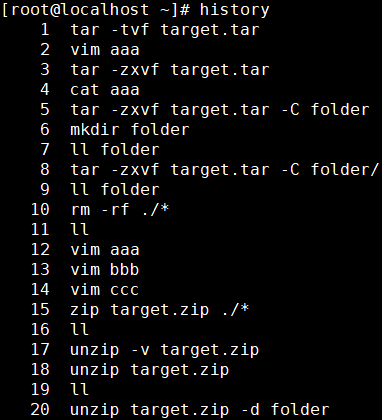

# 第四节 辅助命令：history

命令：history

作用：查看命令历史

用法：

将命令的运行结果写入文件：

- 覆盖写：命令 > 文件路径
- 追加写：命令 >> 文件路径

这里给大家介绍一个非常有意思的文件：/dev/null。它被称为Linux系统的黑洞，因为不管写入多少数据到这个文件，数据都会被销毁。

[上一节](verse03-00-index.html) [回目录](verse04-00-index.html) [下一条](verse04-02-echo.html)