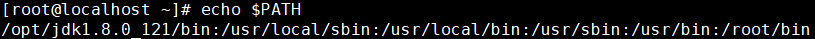

[TOC]

# 第四节 辅助命令：echo


## 1、简介

命令：echo

作用：将数据输出到standard output（标准输出），主要用来打印环境变量的值


## 2、关于standard output

### ①本质

如果我们说把一条数据打印到标准输出，那么我们就是在说：打印到<span style="color:blue;font-weight:bold;">命令行窗口</span>。


### ②对比Java代码

```java
System.out.println("Hello World!");
```

上面这行Java代码将字符串打印到了控制台，而如果我们我们把这段Java程序拿到Linux系统来执行，那么它就打印到standard output了。


## 3、输出环境变量

### ①Linux中引用环境变量

在Linux系统中通过$来引用环境变量，例如：$PATH


### ②使用echo输出环境变量




[上一条](verse04-01-history.html) [回目录](verse04-00-index.html) [下一条](verse04-03-help.html)

