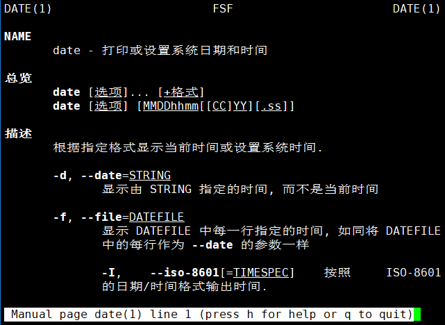
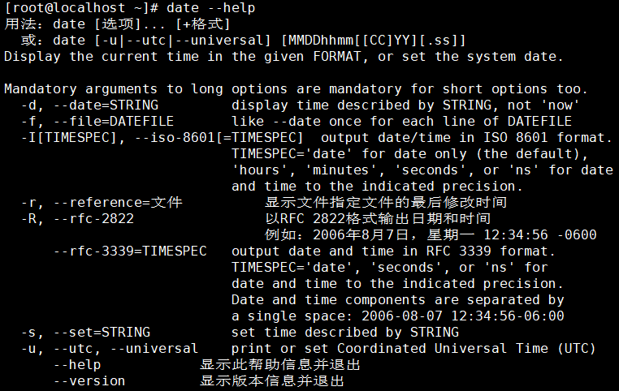

[TOC]

# 第四节 辅助命令：命令帮助

## 1、概述

在我们学习一个新的命令时，Linux系统自带的官方命令手册就是非常权威的参考文档。而man命令和info命令都可以调出一个命令对应的文档。区别在于man命令阅读体验略好，info命令文档内容更完整。

## 2、用法

### ①man命令

命令：man

对应单词：manual

格式：man [要查询的命令]

控制方式：

| 按键    | 说明                                 |
| ------- | ------------------------------------ |
| 空格    | 向下滚动一屏                         |
| 回车    | 向下滚动一行                         |
| b       | 向上滚动一屏                         |
| q       | 退出                                 |
| /关键词 | 搜索关键词 n向下找 N向上找 |

### ②info命令

命令：info

对应单词：information

格式：info [要查询的命令]

控制方式：

| 按键 | 说明 |
| ---- | ---- |
|Up  |Move up one line                |
|Down|Move down one line              |
|DEL |Scroll backward one screenful   |
|SPC |Scroll forward one screenful    |
|PgUp|Scroll backward in this window  |
|PgDn|Scroll forward in this window   |

> 其实info命令每次进入的都是同一个文档，只是不同被查询命令进入的是这个文档的不同位置而已。

### ③补充

大部分命令都有--help参数，也起到参考文档作用。

[上一条](verse04-02-echo.html) [回目录](verse04-00-index.html) [下一条](verse04-04-shutdown.html)