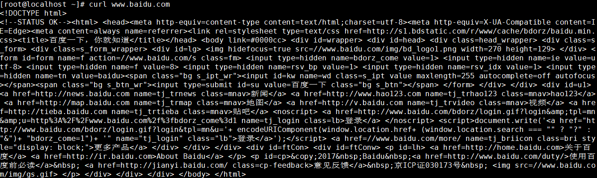

# 第四节 辅助命令：curl

命令：curl

对应单词：client url

作用：通过命令给服务器发送请求

官方文档说明节选：

> curl  is a tool to transfer data from or to a server, using one of the supported protocols (DICT, FILE, FTP, FTPS, GOPHER, HTTP, HTTPS, IMAP, IMAPS, LDAP, LDAPS, POP3, POP3S, RTMP, RTSP, SCP, SFTP, SMTP, SMTPS, TELNET and TFTP).  The command  is designed to work without user interaction.

从文档中我们可以看到curl命令支持的通信协议非常丰富，其中我们最常用的还是HTTP协议。如果有需要curl可以通过参数详细设置请求消息头。

用法举例：

通过-X参数可以指定请求方式：

> curl -X POST [资源的URL地址]

[上一条](verse04-05-backslash.html) [回目录](verse04-00-index.html) [下一条](verse04-07-nohup.html)