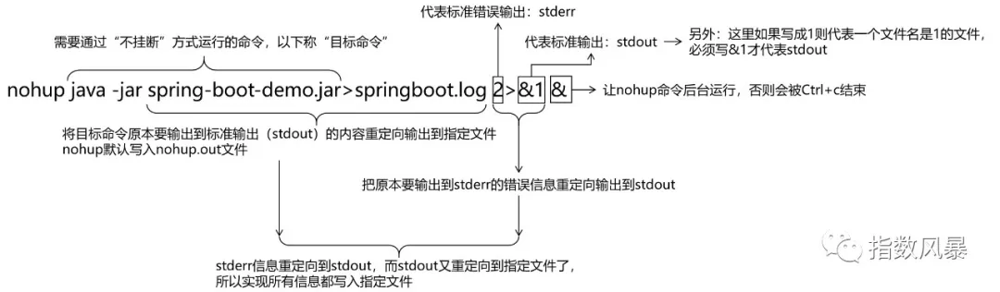

[TOC]

# 第四节 辅助命令：nohup


## 1、提出问题

我们把一个SpringBoot工程导出为jar包，jar包上传到阿里云ESC服务器上，使用java -jar xxx-xxx.jar命令启动这个SpringBoot程序。此时我们本地的xshell客户端必须一直开着，一旦xshell客户端关闭，java -jar xxx-xxx.jar进程就会被结束，SpringBoot程序就访问不了了。

所以我们希望启动SpringBoot的jar包之后，对应的进程可以一直运行，不会因为xshell客户端关闭而被结束。


## 2、命令的前台运行和后台运行

### ①前台运行

默认情况下Linux命令都是前台运行的，前台运行的特点是前面命令不执行完，命令行就一直被前面的命令占用，不能再输入、执行新的命令。

```shell
#!/bin/bash
echo "hello before sleep"
sleep 20
echo "hello after sleep"
```

前台（默认情况）运行上面脚本的效果是：


后台运行上面脚本的效果是：


但是以后台方式运行并不能解决前面提出的问题：我们的shell客户端（例如：xshell）和服务器断开连接后，SpringBoot进程会随之结束，这显然不满足我们部署运行项目的初衷。


### ②不挂断运行

所谓“不挂断”就是指客户端断开连接后，命令启动的进程仍然运行。nohup命令就是”no hang up“的缩写。使用nohup命令启动SpringBoot微服务工程的完整写法是：

```shell
nohup java -jar spring-boot-demo.jar>springboot.log 2>&1 &
```




[上一条](verse04-06-curl.html) [回目录](verse04-00-index.html) [下一条](verse04-08-wget.html)