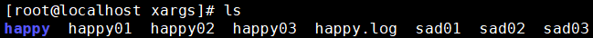
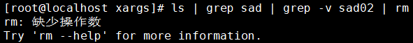
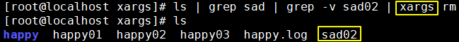

[TOC]

# 第五节 字符串命令：xargs

## 1、情景举例

### ①初始状态

某目录下包含下列资源：

### ②需求

用一条命令删除所有名称中包含“sad”的资源，但是保留sad02

### ③分步实现

#### [1]列出全部资源

#### [2]列出名称中包含“sad”的资源

#### [3]进一步筛选排除sad02

此时最终筛选的结果打印到了标准输出：standard output。通过管道符号可以将标准输出转换为标准输入：standard input。但是删除命令rm不接受标准输入作为参数，只接受命令行参数。什么意思呢？

rm命令前面的管道符号把前面的stdout转换为了stdin再传输给rm命令，这种方式对于有些命令可以，但是有些命令不行。例如：mkdir、ls、rm等命令都是。什么是命令行参数呢？

#### [4]使用xargs命令将stdin转换为命令行参数

## 2、结论

xargs命令的作用：将管道符号提供的stdin数据转换为后面命令的命令行参数。

[上一条](verse05-06-sort.html) [回目录](verse05-00-index.html) [下一条](verse05-08-interview.html)