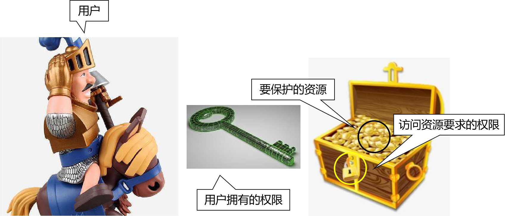
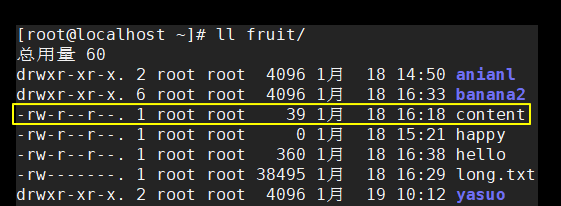
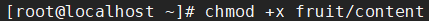
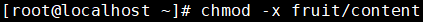

[TOC]

# 第一节 Linux系统的权限控制


## 1、权限

权限=权力+限制。对任何计算机系统来说，我们都不能允许用户在系统中为所欲为。我们必须知道“谁在什么时候对什么资源做了什么操作”，这就是系统日志要记录的内容。不仅如此，系统还必须有能力禁止用户操作没有访问权限的资源。

上述内容转换成权限控制系统中的专业术语：

- 用户：系统使用者登录系统时使用的账号、密码。系统通过“用户”来识别使用者的身份。使用者以“用户”的名义操作系统资源。
- 登录：使用者想要让系统认可自己的身份就必须提供账号、密码等信息。更专业的说法是：“认证（authentication）”。
- 资源：权限控制系统要保护的对象。权限控制系统中必须要保存每一个资源所要求的访问权限。哪怕是“不需要任何权限，任何人都可以使用”也是权限信息的一种描述——没有要求也是一种要求。
- 授权：authorization，系统给用户分配权限。这些权限代表了用户可以做什么。
- 校验：一个用户访问一个资源的时候，权限控制系统必须要检查这个用户持有的权限是否满足目标资源所要求的权限。
- 用户组：同一类的用户归到同一个组，也可以叫做角色。

其实不管多么复杂的权限控制系统都可以归结为下面这个图：




## 2、基础命令

| 命令                   | 作用                           |
| ---------------------- | ------------------------------ |
| groupadd 组名          | 创建用户组                     |
| id 用户名              | 返回用户信息，检查用户是否存在 |
| useradd -g 组名 用户名 | 创建用户，同时指定所属用户组   |
| passwd 用户名          | 给用户账号设置密码             |


## 3、文件权限信息说明


权限信息共分三组，每组三位：


下面介绍rwx-分别是什么意思：

- r：读

  - 读文件：查看文件内容

    例如：cat、less、tail等命令

  - 读目录：查看目录内容

    例如：使用ll命令查看目录内容

- w：写

  - 写文件：向文件中写入新内容

  - 写目录：在目录里面增删内容

    例如：在目录内新建文件、删除文件、新建目录、删除目录给目录重命名

- x：执行

  - 执行文件：把文件当作可执行文件来运行
  - 执行目录：使用cd命令进入目录

- -：无权限

由于每一位要么有权限要么没有权限，所以天然可以使用二进制来表示权限信息：

- 1：有
- 0：无

| 权限的符号表示 | 权限的二进制表示 | 权限的十进制表示 |
| -------------- | ---------------- | ---------------- |
| rwx r-x r-x    | 111 101 101      | 7 5 5            |
| rw- r-- r--    | 110 100 100      | 6 4 4            |


## 4、chxxx命令

| 命令名 | 作用                   |
| ------ | ---------------------- |
| chmod  | 修改权限信息           |
| chown  | 修改文件或目录的所属主 |
| chgrp  | 修改文件或目录的所属组 |

下面来演示一下chmod命令：


### ①修改权限信息前




### ②修改权限信息

增加执行权限




### ③修改权限信息后


### ④再次修改权限信息

移除执行权限




### ⑤修改权限信息后


> 上面演示的操作方式是同时操作所属主、所属组、其他人三个部分，做相同的设置。如果希望精确控制每一位的权限值可以使用数值的形式设置。


## 5、普通用户提升权限

在公司参与开发的过程中，通常我们不会拿到服务器系统的root权限，而是普通用户权限。但是普通用户很多操作无法执行。比如在/opt目录下新建目录：

```shell
# /opt目录下没有aaa目录
[luozhixiang@hadoop001 opt]$ ll
总用量 4
drwxr-xr-x. 2 root root 4096 9月   7 2017 rh

# 用普通用户在/opt下创建aaa目录权限不够
[luozhixiang@hadoop001 opt]$ mkdir aaa
mkdir: 无法创建目录"aaa": 权限不够

# 使用sudo命令临时提权被提示不在sudoers文件中
[luozhixiang@hadoop001 opt]$ sudo mkdir aaa

我们信任您已经从系统管理员那里了解了日常注意事项。
总结起来无外乎这三点：

    #1) 尊重别人的隐私。
    #2) 输入前要先考虑(后果和风险)。
    #3) 权力越大，责任越大。

[sudo] luozhixiang 的密码：
luozhixiang 不在 sudoers 文件中。此事将被报告。

# 目录没有创建成功
[luozhixiang@hadoop001 opt]$ ll
总用量 4
drwxr-xr-x. 2 root root 4096 9月   7 2017 rh
```


将需要提权的普通用户加入到/etc/sudoers文件中

```shell
91 ## Allow root to run any commands anywhere 
92 root    ALL=(ALL)       ALL
93 luozhixiang ALL=(ALL)   ALL
```


不需要重启系统，我们再次测试提权：

```shell
# 操作可以成功，需要密码
[luozhixiang@hadoop001 opt]$ sudo mkdir aaa
[sudo] luozhixiang 的密码：
[luozhixiang@hadoop001 opt]$ ll
总用量 8
drwxr-xr-x. 2 root root 4096 7月  11 04:08 aaa
drwxr-xr-x. 2 root root 4096 9月   7 2017 rh
```


再修改/etc/sudoers文件

```shell
 93 luozhixiang ALL=(ALL)   NOPASSWD:ALL
```


这样再使用sudo命令就不需要输入密码了

```shell
Connecting to 192.168.41.100:22...
Connection established.
To escape to local shell, press 'Ctrl+Alt+]'.

Last login: Sat Jul 11 04:10:14 2020 from 192.168.41.1
[luozhixiang@hadoop001 ~]$ cd /opt
[luozhixiang@hadoop001 opt]$ sudo mkdir aaa
[luozhixiang@hadoop001 opt]$ ll
总用量 8
drwxr-xr-x. 2 root root 4096 7月  11 04:12 aaa
drwxr-xr-x. 2 root root 4096 9月   7 2017 rh
```


这里有两点需要注意：

- 在同一次登录中，即使不加NOPASSWD也只需要输入一次密码，所以NOPASSWD是否生效需要退出登录后再重新登录来测试。
- 使用sudo提权后创建的目录仍然是root root权限，如果有需要那就还要使用chown或chgrp来修改。


[回目录](index.html) [下一节](verse02-service.html)