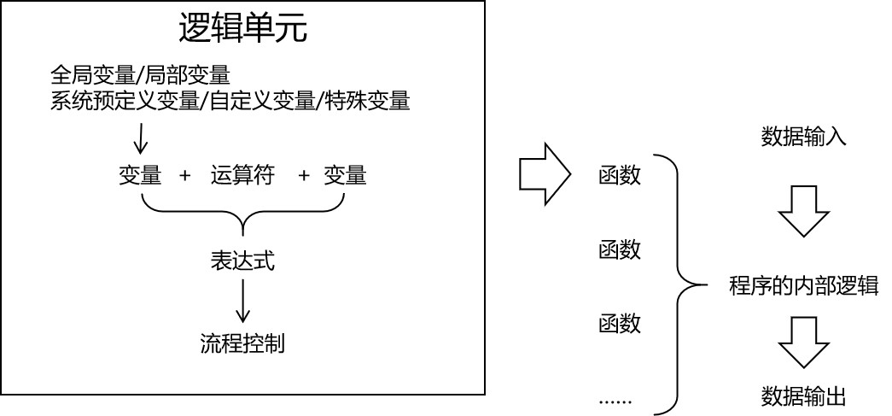

[TOC]

# 第三节 Linux系统环境下Shell脚本开发


# 1、Shell编程概述

Shell是一个命令行解释器，它接收应用程序或用户的命令，然后调用操作系统内核。


Shell还是一个功能强大的编程语言，易编写、易调试、灵活性强。


## ①Linux系统提供的Shell解析器

```shell
[root@hadoop101 ~]$ cat /etc/shells 
/bin/sh
/bin/bash
/sbin/nologin
/usr/bin/sh
/usr/bin/bash
/usr/sbin/nologin
/bin/tcsh
/bin/csh
```

其中最常用的是/bin/sh和/bin/bash


## ②bash和sh的关系

```shell
[root@apple w]# ll /usr/bin | grep bash$
-rwxr-xr-x. 1 root root     964544 4月  11 2018 bash
lrwxrwxrwx. 1 root root          4 7月   9 16:42 sh -> bash
```

sh是bash的软链接


## ③Linux默认的解析器是bash

```shell
[root@apple w]# echo $SHELL
/bin/bash
```


## ④Shell语法总述




# 2、Shell编程HelloWorld


## ①创建脚本文件

通常以.sh作为扩展名。


## ②脚本内容

第一行指定当前脚本的解析器：

```shell
#!/bin/bash
```

实现具体功能：

```shell
echo "hello world"
```


## ③Shell脚本的运行方式

| 命令名             | 在当前进程运行 | 新建子进程运行 |
| ------------------ | -------------- | -------------- |
| source             | √              |                |
| .                  | √              |                |
| sh                 |                | √              |
| bash               |                | √              |
| chmod +x后直接运行 |                | √              |

其中“.”是source的另一种写法。在当前进程中发布的全局变量可以在当前进程的其他脚本中继续沿用，也可以在子进程中使用；但是子进程export发布的变量仅限于子进程内部使用。


从上面进程树中能够看到，sh、bash、直接运行这三种方式确实是开辟新的子进程运行脚本中的代码。


# 3、变量


## ①系统预定义变量

常用系统变量包括：$USER、$HOME、$PWD、$SHELL等，可以使用echo命令输出它们的值。


## ②使用set命令查看所有变量

```shell
ABRT_DEBUG_LOG=/dev/null
BASH=/bin/bash
BASHOPTS=checkwinsize:cmdhist:expand_aliases:extglob:extquote:force_fignore:histappend:interactive_comments:login_shell:progcomp:promptvars:sourcepath
BASH_ALIASES=()
BASH_ARGC=()
BASH_ARGV=()
……
```


## ③自定义变量

### [1]基本语法

#### (1)定义变量

```shell
USER_NAME=tom
```


#### (2)撤销变量

```shell
[root@apple ~]# USER_NAME=tom
[root@apple ~]# echo $USER_NAME
tom
[root@apple ~]# unset USER_NAME
[root@apple ~]# echo $USER_NAME

```


#### (3)声明静态变量

```shell
[root@apple ~]# readonly COMPANY_NAME=atguigu
[root@apple ~]# echo $COMPANY_NAME
atguigu
[root@apple ~]# COMPANY_NAME=uuu
-bash: COMPANY_NAME: 只读变量
[root@apple ~]# unset COMPANY_NAME
-bash: unset: COMPANY_NAME: 无法反设定: 只读 variable
```

不能修改，不能撤销


### [2]语法规则

- 变量名称可以由字母、数字和下划线组成，但是不能以数字开头，环境变量名建议大写。
- 等号两侧不能有空格
- 在bash中，变量默认类型都是字符串类型，无法直接进行数值运算。
- 变量的值如果有空格，需要使用双引号或单引号括起来。


## ④特殊变量

### [1]$n

n是数字，$0代表当前脚本名称。从$1开始代表对应的脚本参数。从${10}开始数字需要使用{}括起来。

```shell
[root@hadoop101 datas]$ touch parameter.sh 
[root@hadoop101 datas]$ vim parameter.sh

#!/bin/bash
echo "$0  $1   $2"

[root@hadoop101 datas]$ chmod 777 parameter.sh

[root@hadoop101 datas]$ ./parameter.sh cls  xz
./parameter.sh  cls   xz
```


### [2]$#

返回输入参数的个数

```shell
[root@hadoop101 datas]$ vim parameter.sh

#!/bin/bash
echo "$0  $1   $2"
echo $#

[root@hadoop101 datas]$ chmod 777 parameter.sh

[root@hadoop101 datas]$ ./parameter.sh cls  xz
parameter.sh cls xz 
2
```


### [3]$*和$@

都能够返回全部参数，但是只有在循环中且放在引号中能够体现出它们的区别。

```shell
[root@hadoop101 datas]$ vim parameter.sh

#!/bin/bash
echo "$0  $1   $2"
echo $#
echo $*
echo $@

[root@hadoop101 datas]$ bash parameter.sh 1 2 3
parameter.sh  1   2
3
1 2 3
1 2 3
```


### [4]$?

返回上一条命令的执行结果。

- 条件判断语句
  - 返回0表示true
  - 返回1表示false
- 普通语句
  - 返回0表示成功
  - 返回非0数表示失败


# 4、运算符

$((表达式))或$[表达式]

```shell
[root@apple ~]# echo $((20+30))
50
[root@apple ~]# echo $(((15+15)*2))
60
[root@apple ~]# echo $[(15+15)*2]
60
```


# 5、条件判断

## ①基本语法

- 写法1：test condition
- 写法2：[ condition ]
  - 注意condition前后有空格
  - 空字符串视为false，非空字符串视为true


## ②常用判断条件

| 数据类型 | 写法 | 含义                             |
| -------- | ---- | -------------------------------- |
| 数值     | -lt  | less than小于                    |
| 数值     | -le  | less equal小于等于               |
| 数值     | -eq  | equal等于                        |
| 数值     | -gt  | greater than大于                 |
| 数值     | -ge  | greater equal大于等于            |
| 数值     | -ne  | not equal不等于                  |
| 文件     | -r   | read有读权限                     |
| 文件     | -w   | write有写权限                    |
| 文件     | -x   | execute有执行权限                |
| 文件     | -f   | file文件存在并且是一个常规的文件 |
| 文件     | -e   | existence文件存在                |
| 文件     | -d   | directory文件存在并是一个目录    |


# 6、流程控制

## ①三目运算

```shell
[root@apple w]# [ 10 -gt 5 ] && echo "10大于5" || echo "10小于5"
10大于5
```


## ②if判断

注意：if后面有空格

### [1]单if

```shell
if [ 10 -gt 5 ]
then
echo "10大于5"
fi
```


### [2]if...else

```shell
if [ 10 -gt 5 ]
then
echo "10大于5"
else
echo "10小于5"
fi
```


### [3]if...elif

```shell
if [ 10 -gt 5 ]
then
echo "10大于5"
elif [ 10 -lt 5 ]
then
echo "10小于5"
else
echo "10等于5"
fi
```


## ③case判断

```shell
AGE=10
case $AGE in
"10")
echo 10
;;
"20")
echo 20
;;
*)
echo other
;;
esac
```


## ④for循环

```shell
for (( i=1;i<=10;i++ ))
do
echo $i
done
```


```shell
#!/bin/bash
# 如果需要使用外部数据，则需要把外部数据赋值给一个变量，不能在for语句中直接使用
len=$1

for (( i=1;i<=len;i++ ))

# 从do关键字开始是循环体开始
do

echo $i;

# 到done关键字为止是循环体结束
done
```


## ⑤for in循环

```shell
for i in $*
do
echo $i
done
```

没有引号的时候$*和$@一样，加了引号就有区别

```shell
for i in "$*"
do
echo $i
done
```

上面代码输出的结果是：

```shell
[root@apple w]# sh shell42.sh a b c d e
a b c d e
```


## ⑥while循环

```shell
s=0
i=1
while [ $i -le 100 ]
do
        s=$[$s+$i]
        i=$[$i+1]
done

echo $s
```


# 7、函数

Shell编程中的函数和我们以前熟悉的函数最大的区别是：Shell编程中要求函数的返回值只能是整数。并且只能通过$?方式获得。可以显示加：return返回，如果不加，将以最后一条命令运行结果，作为返回值。return后跟数值n(0-255)。

```shell
function sum() {
    echo $[$1+$2]
}

sum 10 20
```


```shell
#!/bin/bash
# 声明函数
function sum(){
	# 使用$1、$2引用函数传入的参数
	return $[$1+$2]
}

# 调用函数，传入参数
sum 10 20

# 使用$?获取函数执行结果
echo "sum 10 20执行的结果是$?"
```


# 8、获取脚本外部数据

## ①获取参数

这个前面说过了，通过$1、$2、……方式获取，从${10}开始需要使用大括号。


## ②使用read读取用户输入

read命令有两个常用参数

- -t用于指定输入等待时间，单位是秒
- -p用于指定提示文字

```shell
read -t 10 -p "please enter:" NAME
echo $NAME
```


[上一节](verse02-service.html) [回目录](index.html) [下一节](verse04-environment.html)