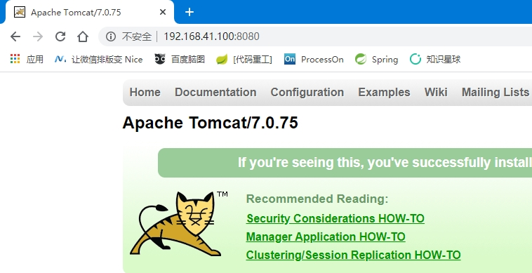

[TOC]

# 第四节 服务器端应用程序安装

##  

## 1、安装JDK

### ①rpm命令

rpm是Redhat package management缩写，实质上来说，通过rpm可以管理Linux环境下的安装包。

| 参数名   | 作用                                                         |
| -------- | ------------------------------------------------------------ |
| -qa      | 查询系统中已经安装的程序，通常配合管道，使用grep精确匹配想要查询的包 |
| -ivh     | 执行rpm包安装操作                                            |
| -e       | 卸载rpm包                                                    |
| --nodeps | 在卸载过程中忽略依赖关系                                     |


### ②卸载系统预装的JDK

查询系统中已经安装的JDK

```shell
[root@apple ~]# rpm -qa | grep openjdk
java-1.8.0-openjdk-headless-1.8.0.161-2.b14.el7.x86_64
java-1.7.0-openjdk-1.7.0.171-2.6.13.2.el7.x86_64
java-1.8.0-openjdk-1.8.0.161-2.b14.el7.x86_64
java-1.7.0-openjdk-headless-1.7.0.171-2.6.13.2.el7.x86_64
```

执行卸载，卸载过程中使用--nodeps忽略依赖关系

```shell
[root@apple ~]# rpm -e --nodeps java-1.8.0-openjdk-headless-1.8.0.161-2.b14.el7.x86_64
[root@apple ~]# rpm -e --nodeps java-1.7.0-openjdk-1.7.0.171-2.6.13.2.el7.x86_64
[root@apple ~]# rpm -e --nodeps java-1.8.0-openjdk-1.8.0.161-2.b14.el7.x86_64
[root@apple ~]# rpm -e --nodeps java-1.7.0-openjdk-headless-1.7.0.171-2.6.13.2.el7.x86_64
```

重启系统生效


### ③解压JDK的tar包配置环境变量

#### [1]解压JDK的tar包

```shell
cd /opt
tar -zxvf /opt/jdk-8u121-linux-x64.tar.gz
```


#### [2]配置JDK相关环境变量

配置环境变量的配置文件：/etc/profile<br/>

为了避免配置错误导致运行失败，提前复制一份/etc/profile

```shell
cp /etc/profile /etc/profile.bak
```


编辑/etc/profile文件

```shell
# 声明JAVA_HOME环境变量，等号两边不能有空格
JAVA_HOME=/opt/jdk1.8.0_121

# 在PATH环境变量原有的值基础上附加JDK的path值，$JAVA_HOME是对JAVA_HOME环境变量的引用
PATH=$JAVA_HOME/bin:$PATH

# 将JAVA_HOME和PATH发布为全局变量
export JAVA_HOME PATH
```


保存退出vim后，使用source命令执行/etc/profile脚本，让脚本中发布的环境变量生效。但是仅限于当前进程，如果想让新环境变量全局生效，可以reboot。

```shell
source /etc/profile
```


验证一下：

```shell
[root@apple jdk1.8.0_121]# echo $JAVA_HOME
/opt/jdk1.8.0_121

[root@apple jdk1.8.0_121]# echo $PATH
/opt/jdk1.8.0_121/bin:/usr/local/sbin:/usr/local/bin:/usr/sbin:/usr/bin:/root/bin

[root@apple jdk1.8.0_121]# java -version
java version "1.8.0_121"
Java(TM) SE Runtime Environment (build 1.8.0_121-b13)
Java HotSpot(TM) 64-Bit Server VM (build 25.121-b13, mixed mode)
```


## 2、安装Tomcat

### ①解压

```shell
tar -zxvf /opt/apache-tomcat-7.0.75.tar.gz
```


### ②操控

启动Tomcat

```shell
/opt/apache-tomcat-7.0.75/bin/startup.sh
```


停止Tomcat

```shell
/opt/apache-tomcat-7.0.75/bin/shutdown.sh
```


查看日志

```shell
tail -f /opt/apache-tomcat-7.0.75/logs/catalina.out
```


部署war包放在webapps目录下

```shell
/opt/apache-tomcat-7.0.75/webapps
```


### ③访问




## 3、MySQL安装步骤

### ①卸载系统预装mariadb

```shell
rpm -e --nodeps mariadb-libs-1:5.5.56-2.el7.x86_64
```


### ②安装服务器端程序

```shell
rpm -ivh /opt/MySQL-server-5.5.52-1.el6.x86_64.rpm
```

验证

```shello
[root@apple opt]# id mysql
uid=988(mysql) gid=982(mysql) 组=982(mysql)
```


### ③安装客户端程序

```shell
rpm -ivh /opt/MySQL-client-5.5.52-1.el6.x86_64.rpm
```


### ④启动MySQL服务

```shell
systemctl start mysql.service
```


### ⑤设置root用户密码

注意：这里的root用户是MySQL的root用户，不是Linux的root用户

```shell
[root@apple opt]# mysqladmin -u root password
New password: 
Confirm new password:
```


### ⑥登录MySQL

```shell
[root@apple opt]# mysql -u root -p
Enter password: 
Welcome to the MySQL monitor.  Commands end with ; or \g.
Your MySQL connection id is 2
Server version: 5.5.52 MySQL Community Server (GPL)

Copyright (c) 2000, 2016, Oracle and/or its affiliates. All rights reserved.

Oracle is a registered trademark of Oracle Corporation and/or its
affiliates. Other names may be trademarks of their respective
owners.

Type 'help;' or '\h' for help. Type '\c' to clear the current input statement.

mysql> show databases;
+--------------------+
| Database           |
+--------------------+
| information_schema |
| mysql              |
| performance_schema |
| test               |
+--------------------+
4 rows in set (0.00 sec)
```


### ⑦客户端登录MySQL服务器

#### [1]被防火墙拦截的错误提示


通过关闭防火墙服务器解决

```shell
systemctl stop firewalld.service
systemctl disable firewalld.service
```


#### [2]被MySQL自己拒绝连接


#### [3]在MySQL服务器端设置允许任何主机地址访问

执行SQL语句

```sql
GRANT ALL PRIVILEGES ON *.* TO 'root'@'%' IDENTIFIED BY 'atguigu' WITH GRANT OPTION;
```


重启MySQL服务

```shell
[root@apple opt]# mysql -u root -p
Enter password: 
Welcome to the MySQL monitor.  Commands end with ; or \g.
Your MySQL connection id is 5
Server version: 5.5.52 MySQL Community Server (GPL)

Copyright (c) 2000, 2016, Oracle and/or its affiliates. All rights reserved.

Oracle is a registered trademark of Oracle Corporation and/or its
affiliates. Other names may be trademarks of their respective
owners.

Type 'help;' or '\h' for help. Type '\c' to clear the current input statement.

mysql> 
mysql> use mysql;
Reading table information for completion of table and column names
You can turn off this feature to get a quicker startup with -A

Database changed
mysql> select host,user,password from user;
+-----------+------+-------------------------------------------+
| host      | user | password                                  |
+-----------+------+-------------------------------------------+
| localhost | root | *453FDE92DF58E2DE1A51D27869CF3F1A69984B1B |
| apple     | root |                                           |
| 127.0.0.1 | root |                                           |
| ::1       | root |                                           |
| localhost |      |                                           |
| apple     |      |                                           |
+-----------+------+-------------------------------------------+
6 rows in set (0.01 sec)

mysql> GRANT ALL PRIVILEGES ON *.* TO 'root'@'%' IDENTIFIED BY 'atguigu' WITH GRANT OPTION;
Query OK, 0 rows affected (0.00 sec)

mysql> select host,user,password,select_priv,update_priv from user;
+-----------+------+-------------------------------------------+-------------+-------------+
| host      | user | password                                  | select_priv | update_priv |
+-----------+------+-------------------------------------------+-------------+-------------+
| localhost | root | *453FDE92DF58E2DE1A51D27869CF3F1A69984B1B | Y           | Y           |
| apple     | root |                                           | Y           | Y           |
| 127.0.0.1 | root |                                           | Y           | Y           |
| ::1       | root |                                           | Y           | Y           |
| localhost |      |                                           | N           | N           |
| apple     |      |                                           | N           | N           |
| %         | root | *453FDE92DF58E2DE1A51D27869CF3F1A69984B1B | Y           | Y           |
+-----------+------+-------------------------------------------+-------------+-------------+
7 rows in set (0.00 sec)
```


重启MySQL服务

```shell
systemctl restart mysql.service
```


### ⑧解决字符乱码问题

#### [1]查看字符相关变量

```sql
mysql> show variables like "%char%";
+--------------------------+----------------------------+
| Variable_name            | Value                      |
+--------------------------+----------------------------+
| character_set_client     | utf8                       |
| character_set_connection | utf8                       |
| character_set_database   | latin1                     |
| character_set_filesystem | binary                     |
| character_set_results    | utf8                       |
| character_set_server     | latin1                     |
| character_set_system     | utf8                       |
| character_sets_dir       | /usr/share/mysql/charsets/ |
+--------------------------+----------------------------+
8 rows in set (0.00 sec)
```


#### [2]准备MySQL配置文件

```shell
cp /usr/share/mysql/my-small.cnf /etc/my.cnf
```

```cnf
[mysqld]
port            = 3306
socket          = /var/lib/mysql/mysql.sock
skip-external-locking
key_buffer_size = 16K
max_allowed_packet = 1M
table_open_cache = 4
sort_buffer_size = 64K
read_buffer_size = 256K
read_rnd_buffer_size = 256K
net_buffer_length = 2K
thread_stack = 128K
character-set-server=utf8
```


在[mysqld]部分的配置的最后添加<span style="color:blue;font-weight:bold;">character-set-server=utf8</span><br/>

重启MySQL服务

```shell
systemctl restart mysql.service
```


查看字符集相关变量

```sql
mysql> show variables like "%char%";
+--------------------------+----------------------------+
| Variable_name            | Value                      |
+--------------------------+----------------------------+
| character_set_client     | utf8                       |
| character_set_connection | utf8                       |
| character_set_database   | utf8                       |
| character_set_filesystem | binary                     |
| character_set_results    | utf8                       |
| character_set_server     | utf8                       |
| character_set_system     | utf8                       |
| character_sets_dir       | /usr/share/mysql/charsets/ |
+--------------------------+----------------------------+
8 rows in set (0.00 sec)
```


重新创建数据库、创建数据库表、插入中文字符数据验证。


[上一节](verse03-shell.html) [回目录](index.html) [下一节](verse05-network.html)