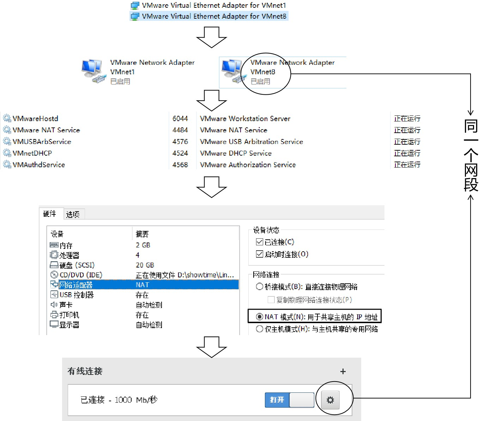
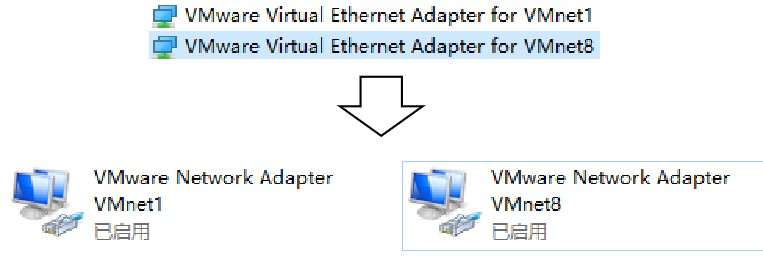

[TOC]

# 第五节 VMWare软件联网原理说明与故障解决

## 1、原理

## 2、常见问题1：Windows端虚拟网卡虚拟网络连接丢失

修复办法：

- 首先将Linux系统关机。
- 打开“虚拟网络编辑器”
- 点击“还原默认设置”（不保证和之前是同一个网段，所以大概率IP地址网段会变）
- 如果修复了虚拟网卡和虚拟网络连接
  - 进入Linux系统修改IP地址，还是要求和虚拟网络编辑器中限定的网段一致
- 如果没有修复成功尝试下面操作
  - 安装CCleaner软件
  - 清理注册表
- 重新进入“虚拟网络编辑器”执行“还原默认设置”
- 如果还没有解决，可以尝试卸载VMWare并清理残留重新安装VMWare
- 如果还不行，重装Windows系统

## 3、常见问题2：虚拟网络连接IP地址乱了

虚拟网卡还在，虚拟网络连接也在，但是和NAT方式对应的虚拟网络连接的IP不是192.168.xxx.xxx了，而是169.254.xxx.xxx。此时已经没法和Linux的IP保持同一个网段了。 

此时唯一的办法：在虚拟网络编辑器中“还原默认设置”。让VMWare的虚拟网络编辑器重置网络连接。

## 4、常见问题3：各方面正常就是连不上

检查一下是不是Windows系统中VMware的服务没有启动，如果是就把服务启动起来。或Linux网卡使用的是仅主机模式，而Linux中IP地址使用的是NAT模式的网段。

[上一节](verse04-environment.html) [回目录](index.html)